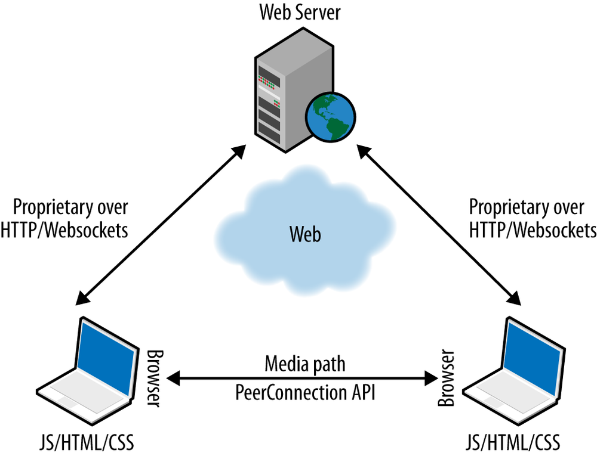

第1章 简介
=====

Web实时通信（WebRTC）是一种新的标准，也是行业的一项努力，它扩展了Web浏览模型。

浏览器首次能够以点对点 (peer-to-peer) 方式直接与其他浏览器交换实时媒体。

万维网联盟 (W3C) 和互联网工程任务组 (IETF) 正在联合定义 JavaScript APIs (Application Programming Interfaces)、标准HTML5标签和底层通信协议，用于在任何一对下一代网络浏览器之间建立和管理可靠的通信信道。

标准化的目标是定义一个网络即时通信应用程序接口，通过对输入外设(如网络摄像头(webcams)和麦克风 )的安全访问，在任何设备上运行的网络应用程序能够以点对点的方式与远程方交换实时媒体和数据。

### Web 架构

经典的网络架构语义基于 `client-server` 模式，浏览器向网络服务器发送一个对内容的 HTTP(Hypertext Transfer Protocol) 请求，网络服务器用包含所请求信息的响应进行回复。

服务器提供的资源与URI (Uniform Resource Identifier) 或URL (Uniform Resource Locator) 已知的实体紧密关联。

在 web 应用程序场景中，服务器可以在发送回客户机的 HTML 页面中嵌入一些 JavaScript 代码。这些代码可以通过标准的 JavaScript api 与浏览器交互，也可以通过用户界面与用户交互。

### WebRTC 架构
WebRTC 在浏览器之间的引入点对点通信范式来扩展 client-server 的语义(semantics)。 最通用的WebRTC架构模型（见图1-1）从所谓的SIP（会话发起协议）梯形（[RFC3261](https://tools.ietf.org/html/rfc3261)）中汲取灵感。

图1-1. WebRTC梯形

在 WebRTC 梯形模型中，两个浏览器都运行一个Web应用程序，该应用程序是从其他Web服务器下载的。 信令消息用于建立和终止通信。 它们是通过 HTTP 或 WebSocket 协议通过 Web 服务器传输的，这些Web服务器可以根据需要修改，转换或管理它们。 值得注意的是，WebRTC 中浏览器和服务器之间的信令未标准化，因为它被认为是应用程序的一部分（请参阅信令）。 关于数据路径，`PeerConnection` 允许媒体直接在浏览器之间流动，而无需任何中间服务器。 这两个Web服务器可以使用标准信令协议（例如SIP或Jingle（XEP-0166））进行通信。 否则，他们可以使用专有的信令协议。

最常见的WebRTC场景很可能是两种浏览器都运行相同的Web应用程序（从相同的网页下载）。 在这种情况下，梯形变为三角形 (见图1-2).

图1-2. WebRTC三角形

