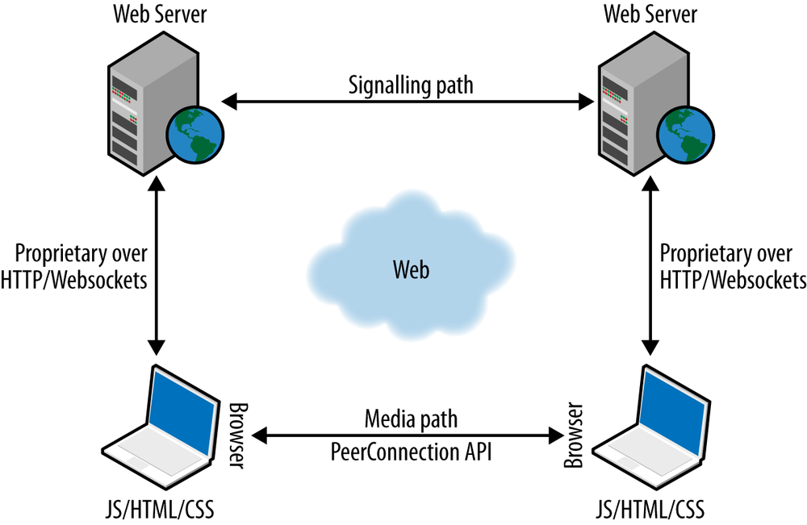

第1章 简介
=====

Web实时通信（WebRTC）是一种新的标准，也是行业的一项努力，它扩展了Web浏览模型。

浏览器首次能够以点对点 (peer-to-peer) 方式直接与其他浏览器交换实时媒体。

万维网联盟 (W3C) 和互联网工程任务组 (IETF) 正在联合定义 JavaScript APIs (Application Programming Interfaces)、标准 HTML5 标签和底层通信协议，用于在任何一对下一代网络浏览器之间建立和管理可靠的通信通道。

标准化的目标是定义一个网络即时通信应用程序接口，通过对输入外设(如网络摄像头(webcams)和麦克风 )的安全访问，在任何设备上运行的网络应用程序能够以点对点的方式与远程方交换实时媒体和数据。

## Web 架构

经典的网络架构语义基于 `client-server` 模式，浏览器向网络服务器发送一个对内容的 HTTP(Hypertext Transfer Protocol) 请求，网络服务器用包含所请求信息的响应进行回复。

服务器提供的资源与 URI (Uniform Resource Identifier) 或 URL (Uniform Resource Locator) 已知的实体紧密关联。

在 web 应用程序场景中，服务器可以在发送回客户机的 HTML 页面中嵌入一些 JavaScript 代码。这些代码可以通过标准的 JavaScript api 与浏览器交互，也可以通过用户界面与用户交互。

## WebRTC 架构
WebRTC 在浏览器之间的引入点对点通信范式来扩展 client-server 的语义(semantics)。 最通用的 WebRTC 架构模型（见图1-1）从所谓的 SIP （会话发起协议）梯形（[RFC3261](https://tools.ietf.org/html/rfc3261)）中汲取灵感。

图1-1 WebRTC 梯形

在 WebRTC 梯形模型中，两个浏览器都运行一个 Web 应用程序，该应用程序是从其他 Web 服务器下载的。 信令消息用于建立和终止通信。 它们是通过 HTTP 或 WebSocket 协议通过 Web 服务器传输的，这些Web服务器可以根据需要修改，转换或管理它们。
值得注意的是，WebRTC 中浏览器和服务器之间的信令未标准化，因为它被认为是应用程序的一部分（请参阅信令）。 关于数据路径，`PeerConnection` 允许媒体直接在浏览器之间流动，而无需任何中间服务器。
这两个 Web 服务器可以使用标准信令协议（例如 SIP 或 Jingle（XEP-0166））进行通信。 或者，也可以使用专有的信令协议。

最常见的 WebRTC 场景很可能是两种浏览器都运行相同的 Web 应用程序（从相同的网页下载）。 在这种情况下，梯形变为三角形 (见图1-2).

图1-2 WebRTC 三角形

## 浏览器中的 WebRTC
WebRTC web 应用程序(通常以 HTML 和 JavaScript 的混合形式编写) 通过标准化的 WebRTC API 与 web 浏览器交互，从而允许它适当地利用和控制实时浏览器功能(参见 图1-3 )。WebRTC web 应用程序还使用 WebRTC 和其他标准化 api 与浏览器进行交互，既可以主动地(例如，查询浏览器功能)，也可以被动地(例如，接收浏览器生成的通知)。

因此，WebRTC API 必须提供广泛的功能集，例如连接管理（以对等方式），编码/解码功能协商，选择和控制，媒体控制，防火墙和 NAT 元素遍历等。

* * *

> #### 网络地址转换(NAT)
>
> 网络地址转换器(NAT) (RFC1631)已经标准化，以缓解 IPv4 地址的稀缺和耗尽。
>
> 私有本地网络边缘的 NAT 设备负责维护私有本地 IP 和端口元组到一个或多个全局惟一的公共 IP 和端口元组的表映射。这使得 NAT 背后的本地 IP 地址可以在许多不同的网络中重用，从而解决了 IPv4 地址耗尽的问题。

* * *

图1-3 浏览器中的实时通信

WebRTC API 的设计确实代表了一个具有挑战性的问题。 它设想通过网络连续不断地实时传输数据流，以允许两个浏览器之间进行直接通信，而沿路径没有其他中介。 这显然代表了基于 Web 的通信的革命性方法。

让我们想象一下两个浏览器之间的实时音频和视频通话。 在这种情况下，通信可能涉及两个浏览器之间的直接媒体流，并通过涉及以下实体的复杂交互序列来协商和实例化媒体路径：

- 调用者浏览器和调用者 JavaScript 应用程序（例如，通过提到的 JavaScript API）
- 调用者 JavaScript 应用程序和应用程序提供者(通常是 web 服务器)
- 应用程序提供者和被调用的 JavaScript 应用程序
- 被调用方 JavaScript 应用程序和被调用方浏览器（同样通过应用程序浏览器 JavaScript API）

## 信令 (Signaling)

WebRTC 的设计背后的总体思想是完全指定如何控制媒体平面，同时尽可能将信令平面留给应用层。其基本原理是，不同的应用程序可能更喜欢使用不同的标准化信令协议(例如，SIP 或可扩展消息传递和到场协议[XMPP])，甚至一些自定义的东西。

会话描述表示需要交换的最重要的信息。它指定了传输(和 *Interactive Connectivity Establishment* [ICE])信息，以及建立媒体路径所需的媒体类型、格式和所有相关的媒体配置参数。

由于以会话描述协议 *Session Description Protocol* (SDP) blobs 的形式交换会话描述信息的最初想法出现了几个缺点，其中一些确实很难解决，IETF 现在正在标准化 JavaScript 会话建立协议 *JavaScript Session Establishment Protocol* (JSEP)。JSEP 提供应用程序所需的接口，以处理协商好的本地和远程会话描述(通过所需的任何信令机制进行协商)，以及与 ICE 状态机交互的标准化方式。

JSEP 方法将驱动信令状态机的职责完全委托给应用程序：应用程序必须在正确的时间调用 API，并将会话描述和相关的 ICE 信息转换为选择信令协议已定义的消息。而不是简单地将浏览器发出的消息转发到远程。

## WebRTC API
W3C WebRTC 1.0 API 允许 JavaScript 应用程序利用新型浏览器的实时功能。 在浏览器核心中实现的实时浏览器功能（请参见 图1-3）提供了建立必要的音频，视频和数据通道所需的功能。 所有媒体和数据流都使用 DTLS 加密。

::: details DTLS 加密

DTLS 实际上用于密钥派生，而 SRTP 用于线路。 因此，线路上的数据包不是 DTLS（初始握手除外）。

:::

* * *

> #### Datagram Transport Layer Security (DTLS)
>
> DTLS（数据报传输层安全性）协议（[RFC6347](https://tools.ietf.org/html/rfc6347)）旨在防止对用户数据报协议（UDP）提供的数据传输进行窃听，篡改或消息伪造。 DTLS 协议基于面向流的传输层安全性（TLS）协议，旨在提供类似的安全性保证。
>

* * *

::: warning 注意

在两个 WebRTC 客户端之间执行的 DTLS 握手依赖于自签名证书。
但是，证书本身无法用于对等方进行身份验证，因为没有明确的信任链可进行验证。

:::

为了确保不同的实时浏览器功能实现之间的互操作性达到基线水平，IETF 正在努力选择支持音频和视频编解码器的最低强制要求集。 已选择 Opus（[RFC6716](https://tools.ietf.org/html/rfc6716)）和 G.711 作为实施音频编解码器的必需项。 但是，在撰写本文时，IETF 尚未就强制实施视频编解码器达成共识。

该 API 围绕三个主要概念进行设计：`MediaStream`，`PeerConnection` 和 `DataChannel`。

### `MediaStream`

`MediaStream` 是音频和/或视频的实际数据流的抽象表示。 它用作管理媒体流操作的句柄，例如显示媒体流的内容，对其进行记录或将其发送到远程对等方。 `MediaStream` 可以扩展为表示来自（远程流）或发送到（本地流）远程节点的流。

`LocalMediaStream` 表示来自本地媒体捕获设备(例如，网络摄像头、麦克风等)的媒体流。要创建和使用本地流，web 应用程序必须通过 `getUserMedia()` 函数请求用户访问。应用程序指定它需要访问的媒体音频或视频的类型。浏览器接口中的设备选择器用作授予或拒绝访问的机制。一旦应用程序完成，它可以通过调用 `LocalMediaStream` 上的 `stop()` 函数来撤销自己的访问权限。

媒体平面信令是在对等点之间的频带上进行的；安全实时传输协议 *Secure Real-time Transport Protocol* (SRTP)用于将媒体数据与用于监视与数据流相关的传输统计信息的 RTP 控制协议 *RTP Control Protocol* (RTCP)信息一起传输。DTLS 用于 SRTP 密钥和关联管理。

如 图1-4 所示，在多媒体通信中，每个媒体通常在单独的 RTP 会话中使用自己的 RTCP 包进行传输。但是，为了克服为每个使用的流打开一个新的 NAT 洞的问题，IETF 目前正在研究减少基于 rtp 的实时应用程序所消耗的传输层端口数量的可能性。这个想法是结合。在单个 RTP 会话中的多媒体通信。

图1-4 WebRTC 协议栈

### `PeerConnection`

`PeerConnection` 允许两个用户在浏览器之间直接通信。然后，它表示与远程对等点的关联，远程对等点通常是在远程端运行的同一JavaScript应用程序的另一个实例。通信通过一个信令通道进行协调，信令通道是通过web服务器中的页面脚本代码提供的，例如使用 `XMLHttpRequest` 或 `WebSocket`。一旦建立了对等连接，就可以将媒体流(与临时定义的 `MediaStream` 对象在本地关联)直接发送到远程浏览器。

* * *

> #### STUN and TURN
>
> NAT会话遍历实用程序（STUN）协议（[RFC5389](https://tools.ietf.org/html/rfc5389)）允许主机应用程序发现网络上网络地址转换器的存在，并且在这种情况下，可以为当前连接获取分配的公共IP和端口元组。 为此，该协议需要已配置的第三方STUN服务器的协助，该服务器必须位于公共网络上。
>
> 围绕NAT的遍历使用中继（TURN）协议（[RFC5766](https://tools.ietf.org/html/rfc5766)）允许NAT后面的主机从驻留在公用Internet上的中继服务器获取公用IP地址和端口。 由于中继了传输地址，主机可以从任何可以将数据包发送到公共Internet的对等方接收媒体。
>

* * *

`PeerConnection` 机制将ICE协议（请参阅[ICE Candidate Exchanging]()）与 STUN 和 TURN 服务器一起使用，以使基于UDP的媒体流穿越NAT盒和防火墙。 ICE允许浏览器发现有关部署它们的网络拓扑的足够信息，以找到最佳的可利用通信路径。 使用ICE还提供了一种安全措施，因为它可以防止不受信任的网页和应用程序将数据发送到不希望接收它们的主机。

每个信令消息在到达时就被馈送到接收方 `PeerConnection` 中。 API发送信令消息，大多数应用程序会将其视为不透明的Blob，但是必须由Web应用程序通过Web服务器安全有效地将其传输到其他对等体。

### `DataChannel`

`DataChannel` API旨在提供通用传输服务，允许Web浏览器以双向对等方式交换通用数据。

IETF内的标准化工作已就使用封装在DTLS中的流控制传输协议（SCTP）处理非媒体数据类型达成了普遍共识（请参见图1-4）。

通过 UDP 的 DTLS 和 ICE 的 SCTP 封装提供了NAT遍历解决方案以及机密性，源身份验证和完整性受保护的传输。此外，该解决方案允许数据传输与并行媒体传输平滑地互通，并且两者都可能共享一个传输层端口号。之所以选择SCTP，是因为它本地支持具有可靠或部分可靠传送模式的多个流。它提供了在SCTP关联中向对等SCTP端点打开几个独立流的可能性。每个流实际上代表一个单向逻辑通道，提供顺序传送的概念。消息序列可以有序或无序发送。消息传递顺序仅保留给在同一流上发送的所有有序消息。但是，`DataChannel API` 已被设计为双向的，这意味着每个 `DataChannel` 都是由传入和传出SCTP流的捆绑组成的。

当在实例化的 `PeerConnection` 对象上首次调用 `CreateDataChannel()` 函数时，将执行 `DataChannel` 设置（即创建 SCTP 关联）。随后每次对 `CreateDataChannel()` 函数的调用都只会在现有SCTP关联内创建一个新的 `DataChannel`。

## 一个简单的例子

Alice 和 Bob 都是共同呼叫服务的用户。为了进行通信，必须将它们同时连接到实现呼叫服务的 Web 服务器。的确，当他们将浏览器指向呼叫服务网页时，他们将下载包含 JavaScript 的 HTML 页面，该 JavaScript 使浏览器通过安全的 HTTP 或 WebSocket 连接保持与服务器的连接。

当 Alice 单击 web page 按钮启动与 Bob 的调用时，JavaScript 实例化 `PeerConnection` 对象。创建 `PeerConnection` 后，调用服务端的 JavaScript 代码需要设置媒体，并通过 `MediaStream` 函数完成此任务。 Alice 还必须允许调用服务访问她的摄像机和麦克风。

在当前的 W3C API 中，一旦添加了一些流，则 Alice 的浏览器中将添加丰富的 JavaScript 代码，从而生成信令消息。 此类消息的确切格式尚未完全定义。 我们确实知道它必须包含媒体频道信息和 ICE 候选者，以及将通信绑定到 Alice 的公钥的指纹属性。 然后将该消息发送到信令服务器（例如，通过 `XMLHttpRequest` 或 `WebSocket` ）。

图1-5 描绘了与 Alice 和 Bob 之间的实时，启用浏览器的通信通道的建立相关的典型呼叫流程。

信令服务器处理来自 Alice 浏览器的消息，确定这是对 Bob 的呼叫，然后将信令消息发送到 Bob 的浏览器。

Bob 浏览器上的 JavaScript 处理传入的消息并提醒 Bob。 如果 Bob 决定接听电话，则在他的浏览器中运行的 JavaScript 随后将实例化与来自 Alice 一方的消息相关的 `PeerConnection`。 然后，将发生类似于 Alice 浏览器上的过程。 Bob 的浏览器会验证呼叫服务已获得批准并创建了媒体流； 之后，将包含媒体信息，ICE 候选对象和指纹的信令消息通过信令服务发送回 Alice。

图1-5 从 Alice 的角度来看通话设置

