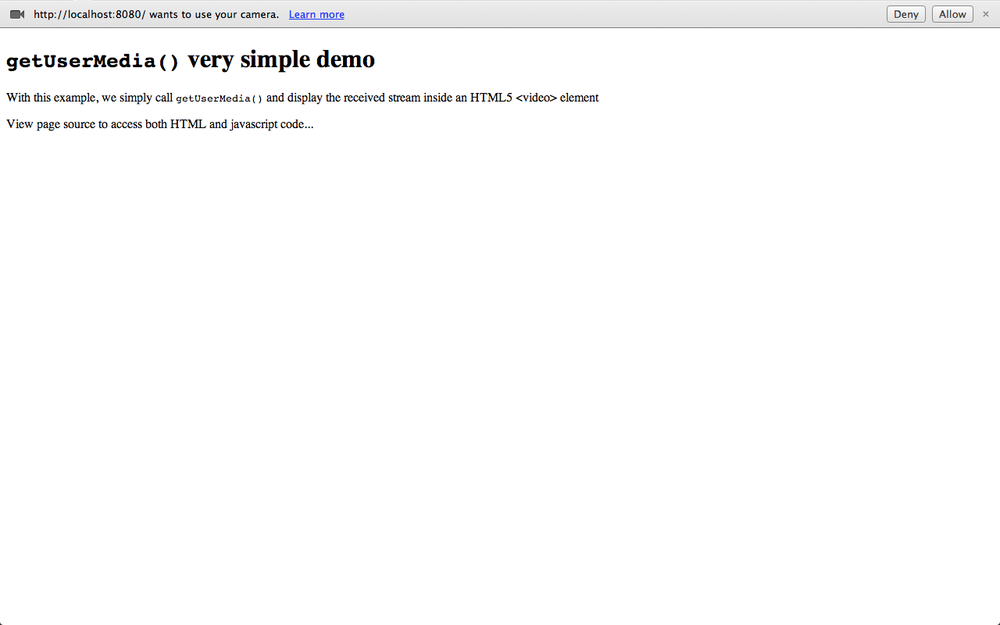

第2章 处理浏览器中的媒体
=====

在本章中，我们将开始研究 WebRTC 框架的细节，该框架基本上指定了一组 JavaScript API，用于开发基于 Web 的应用程序。
这些 API 一开始就被认为是用于实现基本用例的友好工具，例如一对一的音频/视频调用。 它们还应具有足够的灵活性，以保证专家开发人员可以实现各种复杂得多的使用场景。
因此，为程序员提供了一组 API，这些 API 可以大致分为三个逻辑组：

1. 本地和远程音频和视频的获取和管理：
  - `MediaStream` 界面（以及 HTML5 `<audio>` 和 `<video>` 标签的相关用法）

2. 连接管理：
  - `RTCPeerConnection` 接口

3. 管理任意数据：
  - `RTCDataChannel` 接口


## WebRTC 的 10 个步骤

以下 10 个步骤的步骤描述了 WebRTC API 的典型使用场景：

1. 从本地设备（如麦克风、网络摄像头）创建一个 `MediaStream` 对象。
2. 从本地 `MediaStream` 获取 *URL Blob*
3. 使用获取的 *URL Blob* 进行本地预览
4. 创建一个 `RTCPeerConnection` 对象
5. 将本地流添加到新创建的连接
6. 将你自己的会话描述发送到远程对等点  Send your own session description to the remote peer.
7. 从您的对等方接收远程会话描述  Receive the remote session description from your peer.
8. 处理收到的会话描述，并将远程流添加到您的 `RTCPeerConnection`
9. 从远程流获取 *URL Blob*
10. 使用获取的 *URL Blob* 播放远程对等方的音频和/或视频

我们将逐步完成上述步骤。 在本章的其余部分中，我们将涉及整个基于 WebRTC 的点对点通信生命周期的前三个阶段。 这意味着我们暂时将忘记远程对等方，而只专注于如何从浏览器中访问和使用本地音频和视频资源。 在执行此操作的同时，我们还将研究如何在限制条件下播放（例如，强制视频分辨率）。

::: danger WebRTC 支持的浏览器

在撰写本文时，WebRTC API 在 Chrome，Firefox 和 Opera 中可用。 本书中包含的所有示例均已使用这些浏览器进行了测试。 为了简洁起见（由于 Opera 和 Chrome 在实现 API 方面几乎完全相同），我们从现在开始只将 Chrome 和 Firefox 作为运行客户端平台的示例。

:::

## 媒体捕获及数据流

W3C Media Capture and Streams 文档定义了一组 JavaScript API，这些API使应用程序能够从平台请求音频和视频流，以及操纵和处理流数据。

### 流媒体 API

`MediaStream` 接口用于表示媒体数据流。 流可以是输入或输出，也可以是本地或远程（例如，本地网络摄像头或远程连接）。 必须注意，单个 `MediaStream` 可以包含零个或多个轨道。 每个轨道都有一个对应的 `MediaStreamTrack` 对象，该对象代表用户代理中的特定媒体源。 `MediaStream` 中的所有轨道在渲染时进行同步。`MediaStreamTrack` 表示包含一个或多个通道的内容，其中，通道之间具有定义的已知的关系。 通道是此 API 规范中考虑的最小单位。 图2-1显示了由单个视频轨道和两个不同的音频（左声道和右声道）轨道组成的 `MediaStream`


图2-1 由一个视频轨道和两个音频轨道组成的 `MediaStream`

W3C Media Capture Streams API 定义了两种方法 `getUserMedia()` 和 `createObjectUrl()`，以下各节对此进行了简要说明。

### 获取本地多媒体内容

`getUserMedia()` API，通过指定一组（强制或可选）成功和失败的回调函数，Web 开发人员可以访问本地设备媒体（当前是音频和/或视频）

```javascript
getUserMedia(constraints, successCallback, errorCallback)
```

`getUserMedia()` 提示用户许可使用其网络摄像头或其他视频或音频输入。

### URL

`createObjectUrl()` 方法指示浏览器创建和管理与本地文件或二进制对象（blob）关联的唯一URL：

```javascript
createObjectURL(stream)
```

它在 WebRTC 中的典型用法是从 `MediaStream` 对象开始创建 *Blob URL* 。 然后，将在 HTML 页面内使用 *Blob URL* 。 实际上，本地和远程流都需要此过程。


## 使用 `getUserMedia()` API
让我们开始使用 `getUserMedia()` API 调用及其返回的 `MediaStream` 对象。 先准备一个带有 JavaScript 代码的简单 HTML 页面，使我们可以访问本地视频资源并将其显示在 HTML5 `<video>` 标签中。示例 2-1 显示了我们为第一个示例构建的非常简单的页面。

例2-1 我们的第一个启用 WebRTC 的 HTML 页面

```html
<!DOCTYPE html>
<html>
  <head>
    <title>getUserMedia very simple demo</title>
  </head>
  <body>
    <div id="mainDiv">
      <h1><code>getUserMedia()</code> very simple demo</h1>
      <p>With this example, we simply call <code>getUserMedia()</code> and display  the received stream inside an HTML5 <video> element</p>
      <p>View page source to access both HTML and JavaScript code...</p>
      <video autoplay></video>
      <script src="js/getUserMedia.js"></script>
    </div>
  </body>
</html>
```

例2-2 文件 `js/getUserMedia.js`
```javascript
// Look after different browser vendors' ways of calling the getUserMedia()
// API method:
// Opera --> getUserMedia
// Chrome --> webkitGetUserMedia
// Firefox --> mozGetUserMedia

navigator.getUserMedia = navigator.getUserMedia || navigator.webkitGetUserMedia || navigator.mozGetUserMedia;

// Use constraints to ask for a video-only MediaStream:
var constraints = {audio: false, video: true};
var video = document.querySelector("video");

// Callback to be called in case of success...
function successCallback(stream) {

  // Note: make the returned stream available to console for inspection
  window.stream = stream;

  if (window.URL) {
    // Chrome case: URL.createObjectURL() converts a MediaStream to a blob URL

    // Reference: https://github.com/a-wing/webrtc-book-cn/issues/1
    // video.src = window.URL.createObjectURL(stream);

    video.srcObject = stream;
  } else {
    // Firefox and Opera: the src of the video can be set directly from the stream
    video.src = stream;
  }

  // We're all set. Let's just play the video out!
  video.play();
}

// Callback to be called in case of failures...
function errorCallback(error) {
  console.log("navigator.getUserMedia error: ", error);
}

// Main action: just call getUserMedia() on the navigator object
navigator.getUserMedia(constraints, successCallback, errorCallback);
```

以下屏幕截图显示了将页面加载到Chrome（图2-2）或Firefox（图2-3）时的外观。



图2-2 在 Chrome 中打开我们的第一个示例


图2-3 在 Firefox 中打开我们的第一个示例

::: danger 在 Chrome 中打开 JavaScript 文件

如果要在本地计算机上的 Google Chrome 中测试代码，则将面临一些挑战，因为由于安全限制，Chrome 默认不会加载本地文件。 为了解决这些问题，您必须在计算机上本地运行 Web 服务器并使用它来提供应用程序的文件，或者在启动浏览器时使用 `--allow-file-access-from-files` 选项。

:::

从上图中可以看出，两种浏览器在访问本地设备（在本例中为网络摄像头）之前都需要征得用户的同意。 在征得用户的明确同意后，浏览器最终将获取的 `MediaStream` 与页面相关联，如图 2-4 和 2-5 所示。

注意：权限授予与网页的域相关，并且此权限不会扩展到网页上的弹出窗口和其他框架。

图2-4 在 Chrome 中显示获取的 `MediaStream`

图2-5 在 Firefox 中显示获取的 `MediaStream`

深入研究上面报告的简单代码的一些细节，我们可以重点介绍如何调用 API 方法 `getUserMedia(constraints, successCallback, errorCallback)`，其参数具有以下含义：

* `constraints` 对象（请参阅第19页的“媒体约束”），用于指定对只收集本地视频感兴趣的穿戴者（`constraints = {audio: false, video: true}`）
* `success callback` 如果调用，将传递给 `MediaStream`。在我们的例子中，首先将这样的 `MediaStream` 提供给控制台以供用户检查（`window.stream = stream;`）然后，将其附加到 `HTML5` 页面的 `<video>` 元素上并最终显示。 参考控制台对返回对象的检查，图 2-6 显示了在 Chrome 开发人员工具窗口中此类活动输出的快照。 每个 `MediaStream` 都有一个标签，并包含一个或多个表示音频或视频通道的 `MediaStreamTracks`。


图2-6 在 Chrome 的控制台中检查 `MediaStream`

关于返回的流如何附加到 `<video>` 元素，请注意，Chrome 要求转换为所谓的 Blob URL（`video.src = window.URL.createObjectURL(stream);`），而其他启用 WebRTC 的浏览器允许您按原样使用它（`video.src = stream;`）。

::: tip 译者 注

[Chrome 71 移除了 `MediaStream` 的 `URL.createObjectURL`](https://developers.google.com/web/updates/2018/10/chrome-71-deps-rems#remove_urlcreateobjecturl_from_mediastream)

```javascript
video.src = window.URL.createObjectURL(stream);
```

应该改成这种写法：

```javascript
video.srcObject = stream;
```

[感谢 b1ngx 的指出](https://github.com/a-wing/webrtc-book-cn/issues/1)

:::

* `failure callback` 如果被调用，则传递给错误对象。 在我们的基本示例中，提到的回调仅将返回的错误记录到控制台（`console.log("navigator.getUserMedia error: ", error);`）


## 媒体模型

浏览器提供了从源(sources)到接收器(sinks)的媒体管道(pipeline)。 在浏览器中，接收器是 ``，`<video>` 和 `<audio>` 标记。 来源可以是物理网络摄像头，麦克风，来自用户硬盘驱动器的本地视频或音频文件，网络资源或静态图像。 这些来源产生的媒体通常不会随时间变化。 这些源可以被认为是静态的。 向用户显示此类源的接收器（实际标签本身）具有用于控制源内容的各种控件。

`getUserMedia()` API方法添加了动态源，例如麦克风和相机。 这些来源的特性可能会根据应用需求而变化，这些来源本质上可以被认为是动态的。

### 媒体约束

约束是一项可选功能，用于限制 `MediaStream` 轨道源上允许的可变性范围。约束通过 `Constrainable` 接口在轨道上公开，该接口包括用于动态更改约束的 API

`getUserMedia()` 调用还允许在首次获取轨道时应用一组初始约束（例如，设置视频分辨率的值）

约束的核心概念是一种功能，它由对象的属性或特征以及可能的值集组成，可以将值指定为范围或枚举。

约束存储在 `track` 对象上，而不是对象资源。每个轨道都可以选择使用约束进行初始化。另外，可以在初始化之后通过专用的约束 API 添加约束。

约束可以是可选的或强制的。可选约束由有序列表表示，而强制约束与无序集合相关。

这样做是为了在发布 API 的最终版本之前为更多约束提供支持。约束包括高宽比，面向照相机的模式（正面或背面），音频和视频帧率，视频高度和宽度等等。

### 使用约束

在本节中，我们将快速了解如何使用 `getUserMedia()` 调用获取轨道时如何应用初始约束集。

::: danger WebRTC 浏览器中的 `getUserMedia()` 约束支持

目前仅在 Chrome 中支持 `getUserMedia()` 约束。 本节中的示例将假定您使用此浏览器。

:::

首先，在 例2-3 中构建HTML页面。

例2-3 播放和约束：在 HTML 页面
```html
<!DOCTYPE html>
<!DOCTYPE html PUBLIC "-//W3C//DTD HTML 4.01 Transitional//EN"
		"http://www.w3.org/TR/html4/loose.dtd">
<html>
	<head>
		<title>getUserMedia() and constraints</title>
	</head>
	<body>
		<div id="mainDiv">
			<h1><code>getUserMedia()</code>: playing with video constraints</h1>
			<p>Click one of the below buttons to change video resolution...</p>
			<div id="buttons">
				<button id="qvga">320x240</button>
				<button id="vga">640x480</button>
				<button id="hd">1280x960</button>
			</div>
			<p id="dimensions"></p>
			<video autoplay></video>
			<script src="js/getUserMedia_constraints.js"></script>
		</div>
	</body>
</html>
```
从 例2-3 中的代码片段和 图2-7 中的快照都可以看到，该页面包含三个按钮，每个按钮与以特定分辨率（从低分辨率到高清视频）表示的本地视频流相关联


图2-7 一个简单的 HTML 页面，显示 Chrome 中约束的使用

例2-4 显示了用于获取本地视频流并明确定义的分辨率添加到网页的 JavaScript 代码

例2-4 播放约束： `getUserMedia_constraints.js` 文件
```javascript
// Define local variables associated with video resolution selection
// buttons in the HTML page
var vga Button = document.querySelector("button#vga");
var qvgaButton = document.querySelector("button#qvga");
var hdButton = document.querySelector("button#hd");

// Video element in the HTML5 pagevar
video = document.querySelector("video");

// The local MediaStream to play with
var stream;

// Look after different browser vendors' ways of calling the
// getUserMedia() API method:
navigator.getUserMedia = navigator.getUserMedia ||
  navigator.webkitGetUserMedia || navigator.mozGetUserMedia;

// Callback to be called in case of success...
function successCallback(gotStream) {
  // Make the stream available to the console for introspection
  window.stream = gotStream;

  // Attach the returned stream to the <video> element
  // in the HTML page
  video.src = window.URL.createObjectURL(stream);

  // Start playing video
  video.play();
}

// Callback to be called in case of failure...
function errorCallback(error){
  console.log("navigator.getUserMedia error: ", error);
}

// Constraints object for low resolution video
var qvgaConstraints = {
  video: {
    mandatory: {
      maxWidth: 320,
      maxHeight: 240
    }
  }
};

// Constraints object for standard resolution video
var vgaConstraints = {
  video: {
    mandatory: {
      maxWidth: 640,
      maxHeight: 480
    }
  }
};

// Constraints object for high resolution video
var hdConstraints = {
  video: {
    mandatory: {
      minWidth: 1280,
      minHeight: 960
    }
  }
};

// Associate actions with buttons:
qvgaButton.onclick = function() {
  getMedia(qvgaConstraints)
};

vgaButton.onclick = function() {
  getMedia(vgaConstraints)
};

hdButton.onclick = function() {
  getMedia(hdConstraints)
};

// Simple wrapper for getUserMedia() with constraints object as
// an input parameter
function getMedia(constraints) {
  if (!!stream) {
    video.src = null;
    stream.stop();
  }
  navigator.getUserMedia(constraints, successCallback, errorCallback);
}
```
例2-4 中的代码非常简单。 核心部分与约束对象的正确定义有关，每个约束对象都可以作为输入参数传递给 `getUserMedia()` 函数。 其中包含的三个样本对象只是简单地指出，视频应视为强制性的，并根据视频的宽度和高度的下限进一步指定分辨率。 为了使读者了解其含义，图2-8 和 图2-9 分别显示了320×240 和 640×480 的分辨率流。

图2-8 在 Chrome 中显示 320×240 分辨率的视频

图2-9 在 Chrome 中显示 640×480 分辨率的视频

