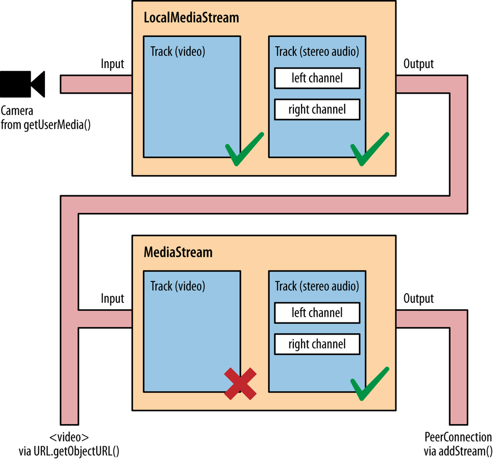

第3章 构建浏览器 RTC 梯形图：本地透视图 **Building the Browser RTC Trapezoid: A Local Perspective**
=====


在上一章中，我们通过介绍了所谓的10步 Web real-time 通信配方的前三个步骤，开始深入研究 Media Capture and Streams API。 尤其是，我们讨论了一些示例，这些示例展示了如何使用 `getUserMedia()` 方法访问和管理本地媒体流。现在开始研究通信部分的时机已经成熟。

在本章中，我们将分析 WebRTC 1.0 API，其主要目的是允许向其他浏览器发送和接收媒体

正如我们在前几章中已经预期的那样，需要一种机制来适当地协调实时通信，并允许对等方交换控制消息。 在 WebRTC 内部尚未定义这种机制（通常称为信令），因此不属于 RTCPeerConnection API 规范。

在一开始就做出了使这种 API 与信令不可知的选择。 WebRTC 中的信令未标准化，因为浏览器之间的互操作性是由 Web 服务器使用下载的 JavaScript 代码来确保的。 这意味着 WebRTC 开发人员可以通过依赖于他们最喜欢的消息传递协议（SIP，XMPP，Jingle等）来实现信令通道，或者他们可以设计一种专有的信令机制，该机制可能仅提供应用程序所需的功能。

关于 WebRTC 应用程序这一部分的唯一的体系结构要求涉及在 Web浏览器 和 Web服务器 之间正确配置的双向通信通道的可用性。 XMLHttpRequest（XHR），WebSocket 以及 Google 的 Channel API 之类的解决方案都是很好的选择

需要信令通道以允许WebRTC对等点之间交换三种类型的信息：

* 媒体会话管理
设置和断开通信，并报告潜在的错误情况

* 节点的网络配置
即使存在NAT也可用于交换实时数据的网络地址和端口

* 节点的多媒体功能
支持的媒体，可用的编码器/解码器（编解码器），支持的分辨率和帧速率等。

在正确交换和协商所有上述信息之前，WebRTC 对等方之间无法传输任何数据。

在本章中，我们将忽略与信令通道的设置（和使用）有关的所有上述问题，仅关注 `RTCPeerConnection API` 的描述。我们将通过某种方式在单台计算机上模拟对等行为来实现此目标。这意味着我们暂时将绕过信令通道设置阶段，并让上述三个步骤（会话管理，网络配置和多媒体功能交换）在单个计算机上进行。
在第5章中，我们将通过展示本地场景如何在两个启用 WebRTC 的对等点之间引入真正的信令通道，来最终向 WebRTC 建筑中添加最后一块砖。


回到 API，调用 `new RTCPeerConnection(configuration)` 会创建一个 `RTCPeerConnection` 对象，该对象是两个用户/浏览器之间通信通道的抽象，可以为特定的 `MediaStream` 输入或输出，如 图3-1 所示。配置参数包含信息，以查找对 NAT 遍历设置阶段必需的对 STUN 和 TURN 服务器的访问。




图3-1 将 `MediaStream` 添加到 `PeerConnection`

本地使用 `PeerConnection` 对象：一个示例

现在让我们从 例3-1 中显示的简单HTML代码开始。

例3-1 本地 `RTCPeerConnection` 用法示例
```html
<!DOCTYPE html PUBLIC "-//W3C//DTD HTML 4.01 Transitional//EN"
    "http://www.w3.org/TR/html4/loose.dtd">

<html>
  <head>
    <title>Local PeerConnection() example</title>
  </head>
  <body>
    <table border="1" width="100%">
      <tr>
        <th>Local video</th>
        <th>'Remote' video</th>
      </tr>
      <tr>
        <td><video id="localVideo" autoplay></video></td>
        <td><video id="remoteVideo" autoplay></video></td>
      </tr>
      <tr>
        <td align="center">
          <div>
            <button id="startButton">Start</button>
            <button id="callButton">Call</button>
            <button id="hangupButton">Hang Up</button>
          </div>
        </td>
        <td><!-- void --></td>
      </tr>
    </table>
    <script src="js/localPeerConnection.js"></script>
  </body>
</html>
```

例3-1 充当两个视频流的容器，以表格式并排表示。 左侧的流表示本地捕获，而右侧的流则模拟远程方（实际上是对本地音频和视频设备的进一步捕获）。 媒体捕获和渲染是由与三个按钮关联的事件触发的，这三个按钮分别用于启动应用程序，在本地和（假）远程用户之间进行呼叫以及挂断该呼叫。 像往常一样，此应用程序的核心是文件 localPeerConnection.js 中包含的 JavaScript 代码，其报告如下：

[由于这段代码太长，单独放到一个文件里了](js/localPeerConnection.js)


为了轻松理解此代码的内容，让我们逐步跟踪我们应用程序的发展。 我们将显示使用 Chrome 和 Firefox 拍摄的屏幕截图，因此您可以欣赏与应用程序外观和两种浏览器提供的开发人员工具相关的差异。


### Starting the Application

当用户单击Chrome（图3-2）和Firefox（图3-3）中的“开始”按钮时，会发生以下情况


图3-2 在 Chrome 中加载的示例页面


图3-3 在 Firefox 中加载的示例页面

从两个图中都可以看到，浏览器正在征求用户同意访问本地音频和视频设备。 从上一章我们知道，这是由于执行了 `getUserMedia()` 调用，如下面的 JavaScript 片段所示：

```javascript
// Function associated with clicking on the Start button
// This is the event triggering all other actions
function start() {
  log("Requesting local stream");

  // First of all, disable the Start button on the page
  startButton.disabled = true;

  // Get ready to deal with different browser vendors...
  navigator.getUserMedia = navigator.getUserMedia ||
    navigator.webkitGetUserMedia || navigator.mozGetUserMedia;

  // Now, call getUserMedia()
  navigator.getUserMedia({audio:true, video:true}, successCallback, function(error) {
    log("navigator.getUserMedia error: ", error);
  });
}
```

一旦用户同意，就会触发 `successCallback()` 函数。该函数只是将本地流（包含音频和视频轨道）附加到 HTML5 页面中的 `localVideo` 元素：
```javascript
// Associate the local video element with the retrieved stream
if (window.URL) {
  localVideo.src = URL.createObjectURL(stream);
} else {
  localVideo.src = stream;
}
localStream = stream;
```

图3-4（Chrome）和图3-5（Firefox）中显示了执行回调的效果。

Figure 3-4. The example page after user grants consent, in Chrome

Figure 3-5. The example page after user grants consent, in Firefox

### 拨打电话 **Placing a Call**

一旦获得同意，“开始”按钮将被禁用，而“呼叫”按钮将依次变为启用状态。 如果用户单击它，则会触发 `call()` 函数。 该功能首先执行一些基本的内务处理，例如禁用“呼叫”按钮和启用“挂断”按钮。 然后，对于 Chrome 和 Opera （ Firefox 当前未实现此功能），它将有关可用媒体轨道的一些信息记录到控制台：

```javascript
// Function associated with clicking on the Call button
// This is enabled upon successful completion of the Start button handler
function call() {

  // First of all, disable the Call button on the page...
  callButton.disabled = true;

  // ...and enable the Hangup button
  hangupButton.disabled = false;
  log("Starting call");

  // Note that getVideoTracks() and getAudioTracks() are not currently
  // supported in Firefox...
  // ...just use them with Chrome
  if (navigator.webkitGetUserMedia) {

    // Log info about video and audio device in use
    if (localStream.getVideoTracks().length > 0) {
      log('Using video device: ' + localStream.getVideoTracks()[0].label);
    }
    if (localStream.getAudioTracks().length > 0) {
      log('Using audio device: ' + localStream.getAudioTracks()[0].label);
    }
  }
  ...
```

> ### **Note :**
> 由 Media Capture and Streams API 中的 `MediaStream` 构造函数定义的 `getVideoTracks()` 和 `getAudioTracks()` 方法，返回一系列 `MediaStreamTrack` 对象，分别表示流中的视频轨道和音频轨道。

完成前面的操作后，我们终于进入了代码的核心，即我们第一次遇到 `RTCPeerConnection` 对象的部分：

```javascript
// Chrome
if (navigator.webkitGetUserMedia) {
  RTCPeerConnection = webkitRTCPeerConnection;

  // Firefox
} else if(navigator.mozGetUserMedia) {
  RTCPeerConnection = mozRTCPeerConnection;
  RTCSessionDescription = mozRTCSessionDescription;
  RTCIceCandidate = mozRTCIceCandidate;
}

log("RTCPeerConnection object: " + RTCPeerConnection);
```

上面的代码段包含一些 JavaScript 代码，这些代码的唯一目的是检测使用的浏览器的类型，以便为正确的对象提供正确的名称。 您会从代码中注意到，标准 `RTCPeerConnection` 对象当前在 Chrome（`webkitRTCPeerConnection`） 和 Firefox（`mozRTCPeerConnection`） 中都是前缀。 顺便说一下，后一种浏览器也有一种非标准的方式来命名相关的 `RTCSessionDescription` 和 `RTCIceCandidate` 对象，它们分别与要协商的会话的描述和 ICE 协议候选地址的表示相关联（请参阅第4章）。

一旦确定了（正确的）`RTCPeerConnection` 对象，我们最终可以实例化它：

```javascript
// This is an optional configuration string, associated with
// NAT traversal setup
var servers = null;

// Create the local PeerConnection object
localPeerConnection = new RTCPeerConnection(servers);
log("Created local peer connection object localPeerConnection");

// Add a handler associated with ICE protocol events
localPeerConnection.onicecandidate = gotLocalIceCandidate;
```

上面的代码片段显示了 `RTCPeerConnection` 对象是通过使用可选的 server 参数作为输入的构造函数实例化的。 可以使用此参数来正确处理 NAT 遍历问题，如第4章中所述。


* * *

# `RTCPeerConnection`

调用 `new RTCPeerConnection(configuration)` 将创建一个 `RTCPeerConnection` 对象。 该配置具有查找和访问 STUN 和 TURN 服务器的信息（每种类型可以有多个服务器，任何 TURN 服务器也可以用作 STUN 服务器）。 （可选）还可以使用第19页的 `MediaConstraints` 对象“Media Constraints”。

调用 `RTCPeerConnection` 构造函数时，它还会创建一个 ICE 代理，该 ICE 代理由浏览器直接控制负责 ICE 状态机。 当 `IceTransports` 约束未设置为 “none” 时，ICE 代理将继续收集候选地址。

`RTCPeerConnection` 对象具有两个关联的流集。 表示当前正在发送的流的本地流集（`local streams set`）和表示通过此 `RTCPeerConnection` 对象当前接收的流的远程流集（`remote streams set`）。 创建 `RTCPeerConnection` 对象时，流集将初始化为空集。


这里要注意的有趣事情是，通过定义适当的回调方法，新创建的 `PeerConnection` 的配置是异步完成的。

* * *


> ### **Note :**
> 每当浏览器内部的 ICE 协议机器将新候选者提供给本地对等方时，就会触发 `onicecandidate` 处理程序。

```javascript
// Handler to be called whenever a new local ICE candidate becomes available
function gotLocalIceCandidate(event) {
  if (event.candidate) {
    // Add candidate to the remote PeerConnection
    remotePeerConnection.addIceCandidate(new RTCIceCandidate(event.candidate));
    log("Local ICE candidate: \n" + event.candidate.candidate);
  }
}
```

> ### **译者 注**
> `if (event.candidate === null) { console.log("ICE Candidate was null, done") }`
>
> 这个 `event.candidate` 是可以为空的，当为空时说明 iceServer 已经遍历完成，不会再有新的 candidate 产生


> ### **Note :**
> `addIceCandidate()` 方法向 ICE 代理提供远程候选对象。 除了将其添加到远程描述中之外，只要 `IceTransports` 约束未设置为 “none”，连通性检查将被发送到新的候选对象。


该代码片段理所当然地认为远程对等点实际上是在本地运行的，从而避免了通过正确配置的信令通道将有关收集的本地地址的信息发送给另一方的需求。 这就是为什么如果您尝试在两台远程计算机上运行该应用程序将根本无法运行的原因。 在随后的章节中，我们将讨论如何创建这样的信令通道，并使用它来将 ICE 相关（以及会话相关）信息传输到远程方。 目前，我们仅将收集的本地网络可达性信息添加到（本地可用）远程对等连接（`remote peer connection`）。 显然，在主叫方和被叫方之间切换角色时，同样的道理也适用，即，只要有远程候选者，它们就会被简单地添加到本地对等连接（`local peer connection`）中：


```javascript
// Create the remote PeerConnection object
remotePeerConnection = new RTCPeerConnection(servers);
log("Created remote peer connection object remotePeerConnection");

// Add a handler associated with ICE protocol events...
remotePeerConnection.onicecandidate = gotRemoteIceCandidate;

// ...and a second handler to be activated as soon as the remote
// stream becomes available
remotePeerConnection.onaddstream = gotRemoteStream;
```

> ### **Note :**
> 每当远程对等方分别添加或删除 `MediaStream` 时，都会调用 `onaddstream` 和 `onremovestream` 处理函数。这两者仅在执行 `setRemoteDescription()` 方法时才会被触发。


上面的代码片段与 `onaddstream` 处理函数有关，该处理函数的实现在将远程流（一旦可用时）附加到 HTML5 页面的 `remoteVideo` 元素后进行查找，如下所示：

```javascript
// Handler to be called as soon as the remote stream becomes available
function gotRemoteStream(event) {
  // Associate the remote video element with the retrieved stream
  if (window.URL) {
    // Chrome
    remoteVideo.src = window.URL.createObjectURL(event.stream);
  } else {
    // Firefox
    remoteVideo.src = event.stream;
  }
  log("Received remote stream");
}
```

回到 `Call()` 函数，剩下的唯一动作是将本地流添加到本地 `PeerConnection` 并最终在其上调用 `createOffer()` 方法：

```javascript
...
  // Add the local stream (as returned by getUserMedia()
  // to the local PeerConnection
  localPeerConnection.addStream(localStream);

  log("Added localStream to localPeerConnection");

  // We're all set! Create an Offer to be 'sent' to the callee as soon as
  // the local SDP is ready
  localPeerConnection.createOffer(gotLocalDescription,onSignalingError);
}

function onSignalingError(error) {
  console.log('Failed to create signaling message : ' + error.name);
}
```

> ### **Note :**
>
> `addStream()` 和 `removeStream()` 方法分别向 `RTCPeerConnection` 对象添加流和移除流。

`createOffer()` 方法起着基本作用，因为它要求浏览器正确检查 `PeerConnection` 的内部状态并生成适当的 `RTCSessionDescription` 对象，从而启动 “提供/应答（`Offer/Answer`）” 状态机。

> ### **Note :**
>
> `createOffer()` 方法生成一个 `SDP Blob`，其中包含：
> 1. 具有会话支持的配置 RFC3264 的 `offer`
> 2. 附加（attached）的 `localMediaStreams` 的描述
> 3. 浏览器支持的 `codec/RTP/RTCP` 选项
> 4. ICE 收集的所有候选对象
> 5. 可以提供约束参数以对生成的要约提供附加控制


当会话描述对应用程序可用时，`createOffer()` 方法就将调用回调（`gotLocalDescription`）作为输入。 同样在这种情况下，当会话描述可用时，则本地对等方（local peer）应使用信令信道将其发送给被叫方。 目前，我们将跳过此阶段，并再次假设远程方实际上是本地可到达的一方，这将转换为以下操作：

```javascript
// Handler to be called when the 'local' SDP becomes available
function gotLocalDescription(description){
  // Add the local description to the local PeerConnection
  localPeerConnection.setLocalDescription(description);
  log("Offer from localPeerConnection: \n" + description.sdp);

  // ...do the same with the 'pseudoremote' PeerConnection
  // Note: this is the part that will have to be changed if
  // you want the communicating peers to become remote
  // (which calls for the setup of a proper signaling channel)
  remotePeerConnection.setRemoteDescription(description);

  // Create the Answer to the received Offer based on the 'local' description
  remotePeerConnection.createAnswer(gotRemoteDescription,onSignalingError);
}
```
如上面的注释片段所述，我们在此将检索到的会话描述直接设置为本地对等方的本地描述和远程对等方的远程描述。


> ### **Note :**
>
> `setLocalDescription() 和 `setRemoteDescription()` 方法指示 `RTCPeerConnection` 将提供的 `RTCSessionDescription` 分别应用为本地描述（`local description`）和远程的 `offer` 或 `answer` 。


然后，我们通过调用远程对等体连接上的 `createAnswer()` 方法来要求远程对等体应答所提供的会话。 一旦远程浏览器将其自己的会话描述提供给远程对等方，此方法就将要调用的回调（`gotRemoteDescription`）作为输入参数。 这样的处理程序实际上反映了呼叫方的伴随回调的行为：

```javascript
// Handler to be called when the remote SDP becomes available
function gotRemoteDescription(description){
  // Set the remote description as the local description of the
  // remote PeerConnection
  remotePeerConnection.setLocalDescription(description);

  log("Answer from remotePeerConnection: \n" + description.sdp);

  // Conversely, set the remote description as the remote description
  // of the local PeerConnection
  localPeerConnection.setRemoteDescription(description);
}
```

`createAnswer()` 方法使用与远程配置中的参数兼容的会话支持的配置生成 SDP `answer`

实际上，可以在浏览器的控制台上跟踪上述整个呼叫流程，如图3-6（Chrome）和图3-7（Firefox）所示。


图3-6 Chrome 控制台跟踪两个本地对等方之间的呼叫


图3-7 Firefox 控制台跟踪两个本地对等方之间的呼叫


这两个快照显示了应用程序已记录的事件序列以及符合SDP格式的会话描述信息。 当我们在第4章中简要介绍会话描述协议时，日志的最后一部分将变得更加清晰。

完成上述所有步骤后，我们终于可以在浏览器窗口中看到两个流，如图3-8（Chrome）和图3-9（Firefox）所示。


Figure 3-8. Chrome showing local and remote media after a successful call

Figure 3-9. Firefox showing local and remote media after a successful call


### 挂断 **Hanging Up**

通话结束后，用户可以通过单击“挂断”按钮将其删除。 这触发了关联处理程序的执行：

```javascript
// Handler to be called when hanging up the call
function hangup() {
  log("Ending call");

  // Close PeerConnection(s)
  localPeerConnection.close();
  remotePeerConnection.close();

  // Reset local variables
  localPeerConnection = null;
  remotePeerConnection = null;

  // Disable Hangup button
  hangupButton.disabled = true;

  // Enable Call button to allow for new calls to be established
  callButton.disabled = false;
}
```

正如我们从快速浏览代码中看到的那样，`hangup()` 处理程序仅关闭实例化的对等连接并释放资源。 然后，它禁用 “挂断” 按钮并启用 “呼叫” 按钮，从而将设置回滚到我们首次启动应用程序后（即，在 `getUserMedia()` 调用之后）立即到达的位置。 从中可以发出新的呼叫，并且可以重新开始游戏。 图3-10（Chrome）和图3-11（Firefox）中描述了这种情况。

> ### **Note :**
>
> `close()` 方法销毁 `RTCPeerConnection` ICE 代理，突然结束任何活动的 ICE 处理和任何活动的流，并释放任何相关资源。

Figure 3-10. Chrome after tearing down a call

Figure 3-11. Firefox after tearing down a call


请注意，两个窗口中的两个帧是不同的，这说明了一个事实，即使不再有对等连接可用，我们现在仍具有实时本地流和冻结的远程流。 这也在控制台日志中报告。

