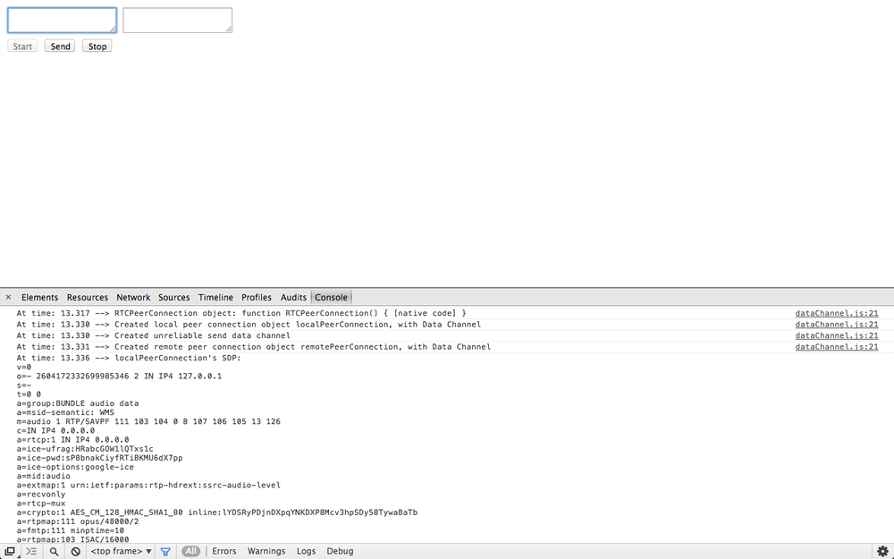
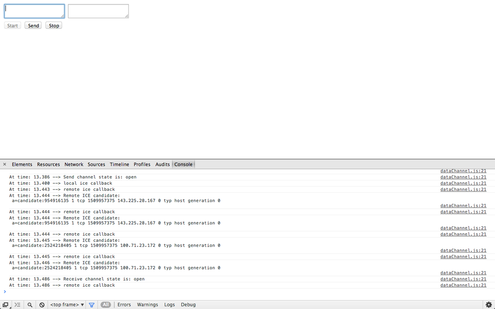
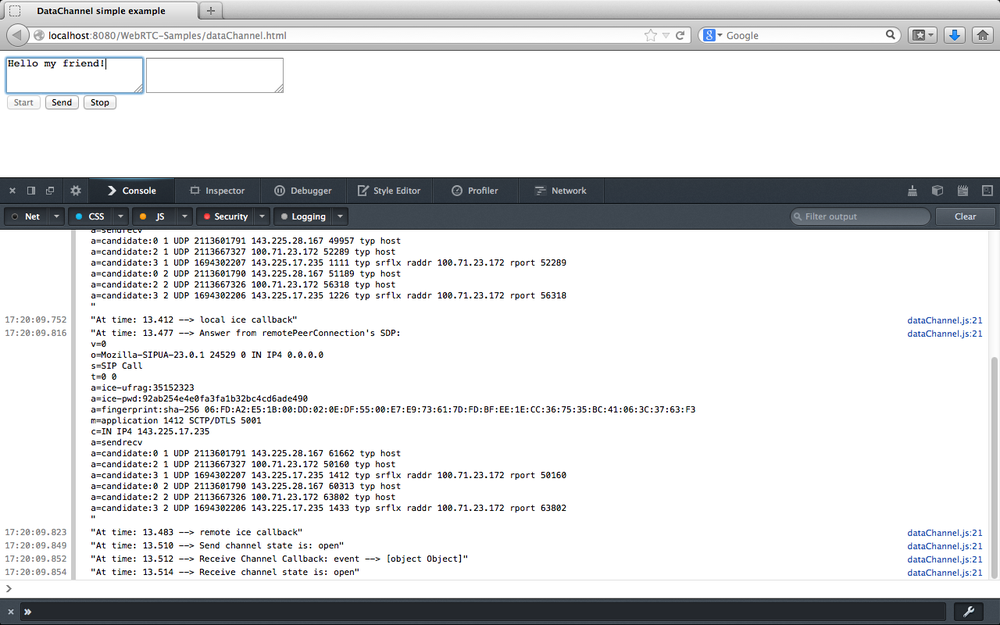
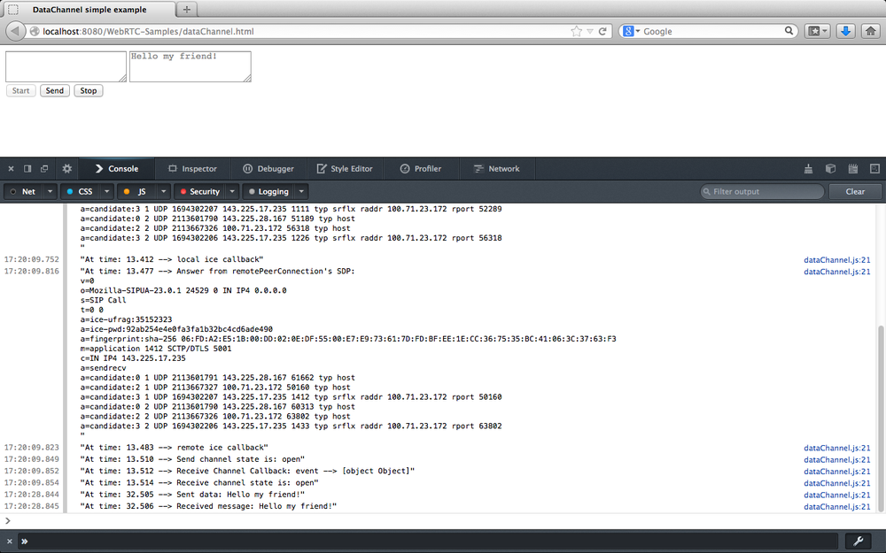
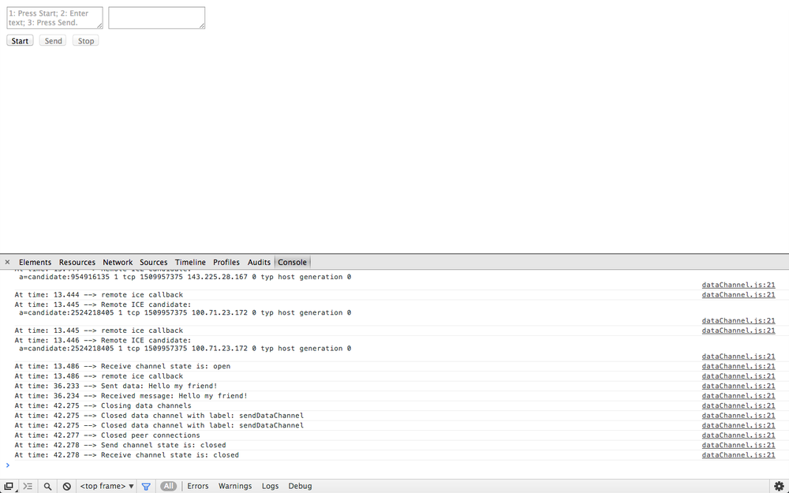
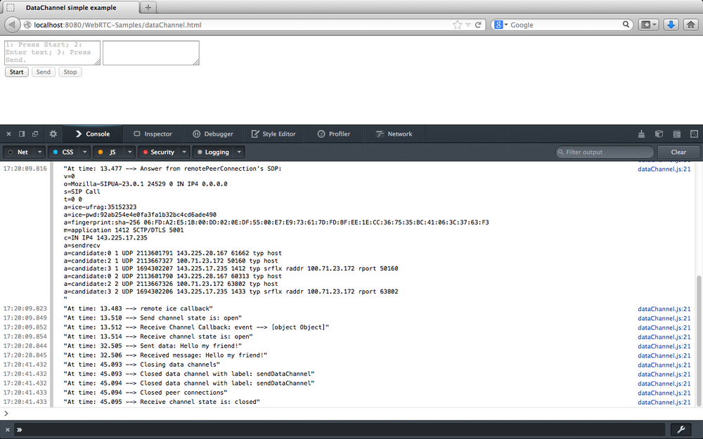

## 将数据通道添加到本地 `PeerConnection`

点对点数据 API 使 Web应用程序 可以以点对点方式发送和接收通用应用程序数据。 用于发送和接收数据的 API 汲取了 WebSocket 的启发。

在本节中，我们将展示如何将 `DataChannel` 添加到 `PeerConnection`。 再次，我们将坚持本地观点，并忽略信号问题。 让我们从 例3-2 中的 HTML5 页面开始。

例3-2 本地数据通道用法示例
```html
<!DOCTYPE html PUBLIC "-//W3C//DTD HTML 4.01 Transitional//EN"
    "http://www.w3.org/TR/html4/loose.dtd">
<html>
  <head>
    <title>DataChannel simple example</title>
  </head>
  <body>
    <textarea rows="5" cols="50" id="dataChannelSend" disabled placeholder="1: Press Start; 2: Enter text; 3: Press Send."></textarea>
    <textarea rows="5" cols="50" id="dataChannelReceive" disabled></textarea>
    <div id="buttons">
      <button id="startButton">Start</button>
      <button id="sendButton">Send</button>
      <button id="closeButton">Stop</button>
    </div>
    <script src="js/dataChannel.js"></script>
  </body>
</html>
```


该页面（在 Chrome 中其外观如 图3-12 所示）仅包含两个并排的文本区域，分别与从发件人的数据通道发送的数据和另一方在另一端接收的数据相关联 接收者的数据通道。 三个按钮用于编排应用程序：（1）在启动时按下的“开始”按钮； （2）需要在数据通道上流式传输新数据时使用的发送按钮； （3）关闭按钮，可用于重置应用程序并将其恢复到原始状态。


图3-12 Chrome 中加载的 `DataChannel` 示例页面


像往常一样，此应用程序的核心行为是在嵌入式 JavaScript 文件 `dataChannel.js` 中实现的，其布局如下：


[由于这段代码太长，单独放到一个文件里了](js/dataChannel.js)


与前面的示例一样，我们将通过逐步跟踪应用程序的生命周期来分析其行为。 我们将跳过所有已经说明的部分。 这使我们可以只关注代码中引入的新功能。

### 启动应用程序

当用户单击页面中的 “开始” 按钮时，幕后会发生许多事件。 即，`createConnection()` 处理程序已激活。 这样的处理程序可以创建本地和（伪）远程对等连接，其方式与前面示例中的方法大致相同。 区别在于，这次，对等连接还配备了用于通用数据流的数据通道：

```javascript
// JavaScript variable associated with proper
// configuration of an RTCPeerConnection object:
// use DTLS/SRTP
var pc_constraints = {
	'optional': [
		{'DtlsSrtpKeyAgreement': true}
	]
};

// Create the local PeerConnection object...
// ...with data channels
localPeerConnection = new RTCPeerConnection(servers,pc_constraints);
log("Created local peer connection object, with DataChannel");

try {

	// Note: SCTP-based reliable data channels supported
	// in Chrome 29+ !
	// use {reliable: false} if you have an older version of Chrome
	sendChannel = localPeerConnection.createDataChannel("sendDataChannel", {reliable: true});

	log('Created reliable send data channel');
} catch (e) {
	alert('Failed to create data channel!');
	log('createDataChannel() failed with following message: ' + e.message);
}
```

上面的代码片段显示了如何通过调用 `createDataChannel()` 方法将 `DataChannel` 添加到现有的 `PeerConnection` 中。 请注意，这是特定于浏览器的功能，而不是标准化的约束。

> ### **Suggestion :**
> WebRTC API 没有使用 `DataChannel` API 定义约束的使用。 相反，它定义了所谓的 `RTCDataChannel Init` 字典（表3-1）的用法。

通过调用 `createDataChannel("sendDataChannel", {reliable: true});` 方法，数据通道本身实际上已添加到新实例化的对等连接中。 代码显示这种数据通道可能不可靠或可靠。通过正确使用 SCTP 协议可以保证可靠性，并且该功能最初仅在 Firefox 中可用。 从 Chrome 版本29开始，才在 Chrome 中实现。

* * *

# createDataChannel

`createDataChannel()` 方法使用给定标签创建一个新的 `RTCDataChannel` 对象。 `RTCDataChannel` 初始化字典（表3-1）可用于配置基础通道的属性，例如数据可靠性。

`RTCDataChannel` 接口表示两个对等点之间的双向数据通道。 每个数据通道都有一个关联的基础数据传输，用于将数据传输到另一个对等方。 创建通道后，对等方将配置基础数据传输的属性（表3-1）。 创建通道后，通道的属性无法更改。 对等方之间的实际 有线 (wire) 协议为 SCTP （请参见第8页的“数据通道”）。

可以将 `RTCDataChannel` 配置为在不同的可靠性模式下运行。 可靠的通道可确保通过重传将数据传递到另一个对等方。 不可靠的通道配置为限制重传次数 (`maxRetransmits`) 或设置允许重传的时间 (`maxRetransmitTime`)。 这些属性不能同时使用，尝试这样做会导致错误。 不设置任何这些属性会导致创建可靠的通道。

* * *

表3-1 `RTCDataChannel Init` 字典成员

Member            | Type           | Description
----------------- | -------------- | -----------
id                | unsigned short | Overrides the default selection of id for this channel.
maxRetransmits    | unsigned short | Limits the number of times a channel will retransmit data if not successfully delivered.
maxRetransmitTime | unsigned short | Limits the time during which the channel will retransmit data if not successfully delivered.
negotiated        | boolean        | The default value of `false` tells the user agent to announce the channel in-band andinstruct the other peer to dispatch a corresponding `RTCDataChannel` object.
ordered           | boolean        | If set to `false`, data are allowed to be delivered out of order. The default value of trueguarantees that data will be delivered in order.
protocol          | DOMString      | Subprotocol name used for this channel


本地数据通道事件（onopen和onclose）通过适当的处理程序进行处理，如下所示：

```javascript
// Associate handlers with send data channel events
sendChannel.onopen = handleSendChannelStateChange;
sendChannel.onclose = handleSendChannelStateChange;
```

至于远程数据通道 (`ondatachannel`)，它也通过事件和相关的回调进行改变：

```javascript
remotePeerConnection.ondatachannel = gotReceiveChannel;
```

伪信令阶段成功完成后，实际上会激活此回调。 通过调用 `localPeerConnection.createOffer(gotLocalDescription, onSignalingError)` 触发此阶段，该阶段将启动上述调用流程，其中涉及 ICE 协议候选者的收集以及会话描述的交换。

图3-13 和 图3-14 中 JavaScript 控制台日志上的注释显示了引导过程的第一阶段，该过程分别在 Chrome 和 Firefox 中进行。 从日志中我们可以看到，在创建本地和远程对等连接之后，`Offer/Answer` 阶段即开始。



图3-13 在 Chrome 中启动数据通道应用程序


图3-14 在 Firefox 中启动数据通道应用程序

特别注意，一旦在 `gotLocalDescription()` 处理程序中为应用程序提供了本地 SDP，就准备好 `Answer` ：

```javascript
function gotLocalDescription(desc) {
  // Set local SDP as the right (local/remote) description for both local
  // and remote parties
  localPeerConnection.setLocalDescription(desc);
  log('localPeerConnection\'s SDP: \n' + desc.sdp);
  remotePeerConnection.setRemoteDescription(desc);

  // Create answer from the remote party, based on the local SDP
  remotePeerConnection.createAnswer(gotRemoteDescription,onSignalingError);
}
```

数据通道状态更改分别通过 `handleSendChannelStateChange()` 和 `handleReceiveChannelStateChange()` 事件处理程序处理。 接收到打开事件后，前一个功能将准备HTML5页面，以便在发送者的文本区域内进行编辑，同时启用 “发送” 和 “关闭” 按钮：

```javascript
if (readyState == "open") {
  // Enable 'Send' text area and set focus on it

  dataChannelSend.disabled = false;
  dataChannelSend.focus();
  dataChannelSend.placeholder = "";

  // Enable both Send and Close buttons
  sendButton.disabled = false;
  closeButton.disabled = false;
...
```

在接收方，状态更改处理程序仅将信息记录到 JavaScript 控制台：

```javascript
function handleReceiveChannelStateChange() {
  var readyState = receiveChannel.readyState;
  log('Receive channel state is: ' + readyState);
}
```

图3-15（Chrome）和图3-16（Firefox）中的快照在引导过程结束时显示了应用程序的状态。



图3-15 启动后，Chrome 中的数据通道应用程序


图3-16 启动后，Firefox 中的数据通道应用程序


### 流文本穿过 Data Channel
一旦数据通道准备就绪，我们最终可以使用它在发送方和接收方之间传输信息。 实际上，用户可以使用 `sendData()` 处理程序在发件人的文本区域内编辑一条消息，然后单击 “发送” 按钮，以便在已实例化的数据通道上流式传输此类信息：

```javascript
function sendData() {
  var data = document.getElementById("dataChannelSend").value;
  sendChannel.send(data);
  log('Sent data: ' + data);
}
```

> ### **Note :**
> `send()` 方法尝试在通道的基础数据传输上发送数据

一旦有新数据到达接收器，`handleMessage()` 处理函数就会被调用。 这样的处理程序首先在接收者的文本区域内打印收到的消息，然后重置发送者的编辑框：

```javascript
function handleMessage(event) {
  log('Received message: ' + event.data);

  // Show message in the HTML5 page
  document.getElementById("dataChannelReceive").value = event.data;

  // Clean 'Send' text area in the HTML page
  document.getElementById("dataChannelSend").value = '';
}
```

图3-17 和 图3-18 分别显示了在 Chrome 和 Firefox 中通过数据通道传输消息之前应用程序的状态。

同样，图3-19（Chrome）和 图3-20（Firefox）在 HTML 页面中报告消息接收和相关操作。


图3-17 准备在 Chrome 中的数据通道流式传输消息



图3-18 准备在 Firefox 中的数据通道流式传输消息


图3-19 从 Chrome 的数据通道接收消息



图3-20 从 Firefox 中的数据通道接收消息


### 关闭应用

完成数据传输后，用户可以单击 “关闭” 按钮以：

* 关闭 data channels:

```javascript
function closeDataChannels() {
  // Close channels...
  log('Closing data channels');
  sendChannel.close();
  log('Closed data channel with label: ' + sendChannel.label);
  receiveChannel.close();
  log('Closed data channel with label: ' + receiveChannel.label);
...
```

> ### **Note :**
> `close()` 方法尝试关闭通道。

* 关闭 peer connections:

```javascript
// Close peer connections
localPeerConnection.close();
remotePeerConnection.close();
// Reset local variables
localPeerConnection = null;
remotePeerConnection = null;
log('Closed peer connections');
```

* Reset the application:

```javascript
...
  // Rollback to the initial setup of the HTML5 page
  startButton.disabled = false;
  sendButton.disabled = true;
  closeButton.disabled = true;
  dataChannelSend.value = "";
  dataChannelReceive.value = "";
  dataChannelSend.disabled = true;
  dataChannelSend.placeholder = "1: Press Start; 2: Enter text; 3: Press Send.";
}
```

通过查看 图3-21（Chrome）和 图3-22（Firefox）中的 HTML 页面和 JavaScript 控制台，读者可以体会到执行此代码的效果。



图3-21 在 Chrome 中关闭频道并重置应用程序



图3-22 在 Firefox 中关闭频道并重置应用程序

