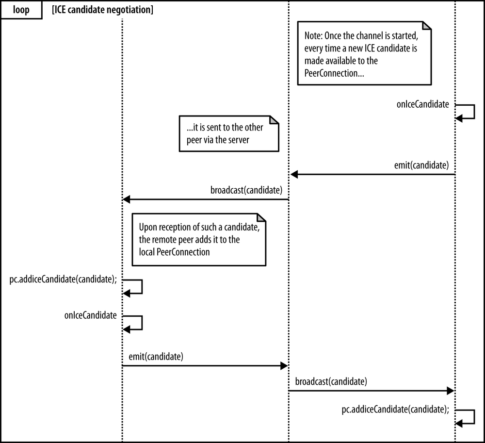
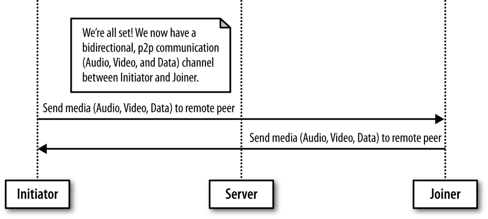
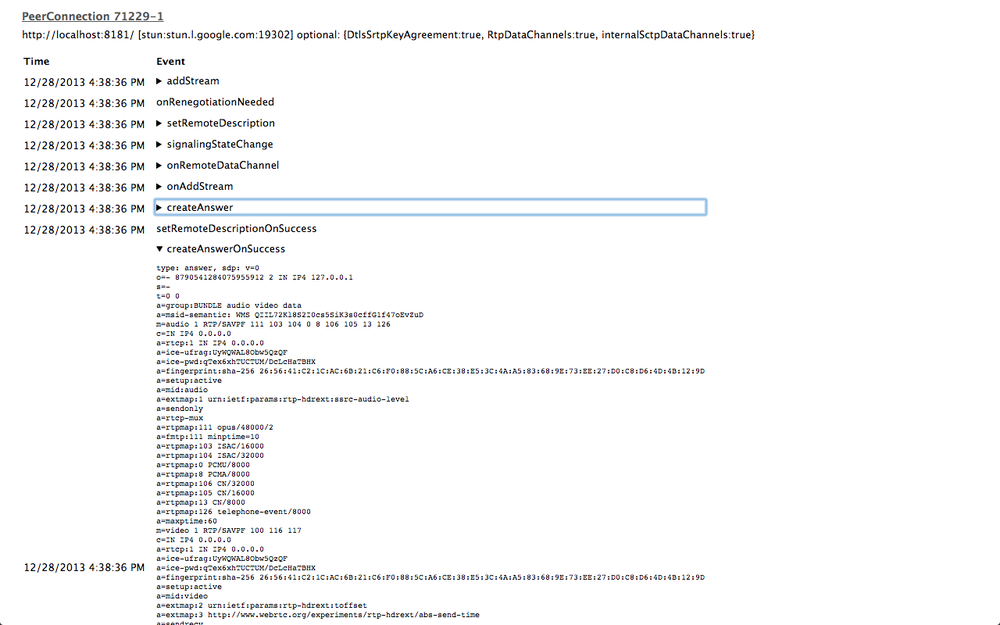
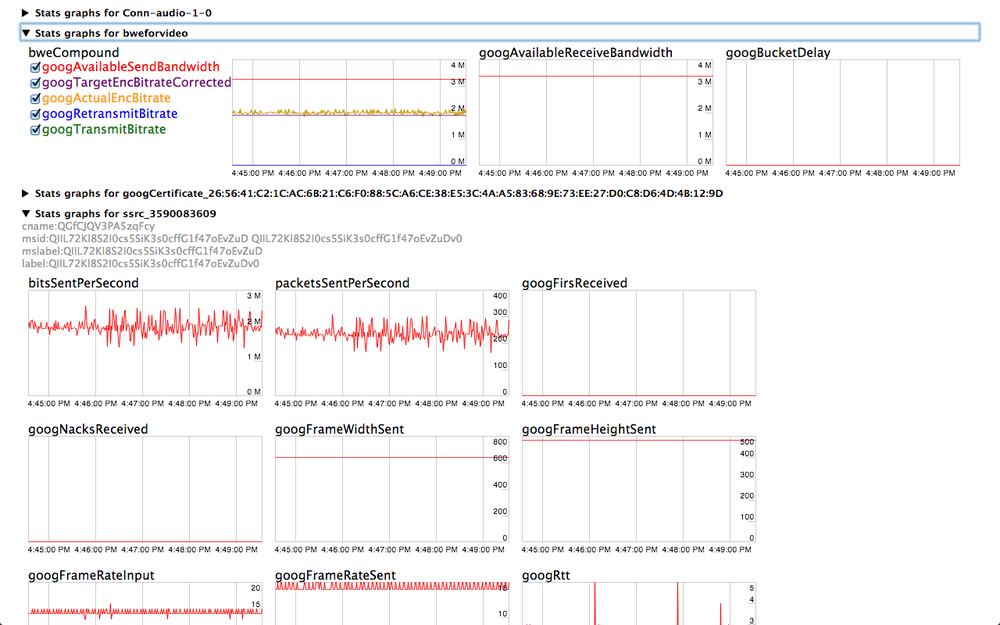
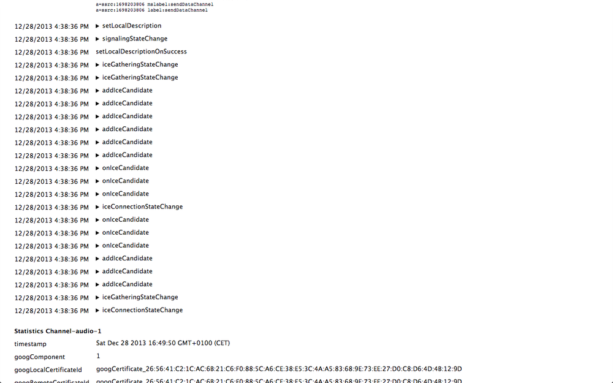

## ICE 候选人交换

正如我们已经预料到的，信令服务器的主要任务之一是使发起方和连接方之间的网络可达性信息能够交换，从而可以在两者之间建立媒体包流。 交互式连接建立（ICE）RFC5245 技术允许对等方发现有关彼此拓扑的足够信息，从而有可能在彼此之间找到一条或多条通信路径。

此类信息由与每个 `RTCPeerConnection` 对象关联的 ICE 代理在本地收集。 ICE 代理负责：

* 收集本地IP，端口元组候选
* 在同级之间执行连接检查
* 发送连接保持活动


设置会话描述（本地或远程）后，本地 ICE 代理会自动开始发现本地对等方所有可能候选者的过程：
1. ICE 代理向操作系统查询本地 IP 地址。
2. 如果已配置，它将查询外部 STUN 服务器以检索对等方的公共 IP 地址和端口元组。
3. 如果已配置，则代理还将 TURN 服务器用作最后的手段。 如果对等连接检查失败，则媒体流将通过 TURN 服务器进行中继。


每当发现新的候选对象（即IP，port tuple）时，ICE 代理就会自动将其注册到 `RTCPeerConnection` 对象，并通过回调函数（`onIceCandidate`）通知应用程序。 该应用程序可以决定在发现每个候选者之后（Trickle ICE）尽快将其转移到远程方，或者决定等待 ICE 收集阶段完成，然后立即发送所有候选者。

与该特定阶段关联的事件顺序如 图5-13 所示。



图5-13 服务器引导的 ICE 候选人交换

该图显示，只要浏览器引发 `IceCandidate` 事件（因为已经收集了一个新的 ICE 候选对象），就会激活 `handleIceCandidate()` 处理程序。 此处理程序将检索到的候选者包装在专用候选者消息中，该消息将通过服务器发送给远程方：

```javascript
function handleIceCandidate(event) {
  console.log('handleIceCandidate event: ', event);
  if (event.candidate) {
    sendMessage({type: 'candidate',label: event.candidate.sdpMLineIndex,id: event.candidate.sdpMid,candidate: event.candidate.candidate});
  } else {
    console.log('End of candidates.');
  }
}
```

像往常一样，服务器只是充当两个协商方之间的中介者，如 图5-14 中的控制台快照所示，它显示了服务器如何中继发起方发送的 SDP 描述和中继方检索到的 ICE 候选地址。 两个相互作用的同伴。


图5-14 服务器引导的协商日志

最后，下面显示的 JavaScript 代码段指示两个对等点一从信令服务器到达，便立即将接收到的候选者添加到其自己的 `PeerConnection` 对象中：

```javascript
// Receive message from the other peer via the signaling server
socket.on('message', function (message) {
  console.log('Received message:', message);
  if (message === 'got user media') {
    ...
  } else if (message.type === 'offer') {
    ...
  } else if (message.type === 'answer' && isStarted) {
    ...
  } else if (message.type === 'candidate' && isStarted) {
      var candidate = new RTCIceCandidate({
        sdpMLineIndex: message.label,
        candidate:message.candidate
      });
      pc.addIceCandidate(candidate);
  } else if (message === 'bye' && isStarted) {
    ...
  }
});
```

一旦其他对等方收到 ICE 候选对象，便在 `RTCPeerConnection` 对象（`setRemoteDescription`）上设置了远程会话描述，因此 ICE 代理可以开始执行连接检查以查看它是否可以到达其他对等方。


此时，每个 ICE 代理都有其候选人和其同行候选人的完整列表。 将它们配对。 为了查看哪个对有效，每个代理计划安排一系列优先检查：首先检查本地 IP 地址，然后检查公共 IP 地址，最后使用 TURN。 每次检查都是客户端将通过从本地候选者向远程候选者发送 STUN 请求而对特定候选对执行的 STUN request/response 事务。

如果一对候选对象中的一个可行，则存在用于点对点连接的路由路径。 相反，如果所有候选项均失败，则 `RTCPeerConnection` 被标记为失败，或者连接回退到 TURN 中继服务器以建立连接。

建立连接后，ICE 代理会继续向其他对等方发出定期的 STUN 请求。 这用作连接保持活动状态。

* * *

# Trickle ICE

Trickle ICE 是ICE协议的拟议扩展，在其中，无需等待 ICE 收集过程完成，就可以向其他对等方发送增量更新。 这有助于加快整个设置阶段。

Trickle ICE机制涉及以下步骤：
* 双方交换没有 ICE 候选人的 SDP offer
* 一旦发现 ICE 候选者，便通过信令信道发送它们。
* 只要有新的候选者描述，便会运行ICE连接检查。

* * *

## Joiner’s Answer

既然我们已经完成了 ICE 候选人交换，那么让我们重新思考一下。 我们当时（第115页上的“ Joiner 管理发起者的 Offer ”）是 Joiner 通过创建自己的 `PeerConnection` 对象来处理发起者的 Offer 的时候。 如 图5-15 所示，完成此操作后，Joiner 首先将接收到的 SDP 与新实例化的 `PeerConnection` 相关联，然后立即调用 `doAnswer()` JavaScript 函数。


图5-15 Joiner’s Answer to Initiator’s Offer

下面的代码片段突出显示了 Joiner 算法的这一特定部分：

```javascript
// Receive message from the other peer via the signaling server
socket.on('message', function (message) {
  console.log('Received message:', message);
  if (message === 'got user media') {
    ...
  } else if (message.type === 'offer') {
    ...
    pc.setRemoteDescription(new RTCSessionDescription(message));

    doAnswer();

  } else if (message.type === 'answer' && isStarted) {
...
```

`doAnswer()` 函数基本上处理与接收到的 Offer 关联的 SDP Answer 的创建：

```javascript
function doAnswer() {
  console.log('Sending answer to peer.');
  pc.createAnswer(setLocalAndSendMessage,onSignalingError, sdpConstraints);
}
```


与 `createOffer()` 方法类似，一旦浏览器使本地 SDP 可用， `createAnswer()` 调用将设置成功处理程序，该处理程序将被调用。 这种处理程序的作用是首先将浏览器提供的 SDP 设置为与 Joiner 的 `PeerConnection` 相关联的本地会话描述，然后通过信令服务器将此类描述发送给远程方：


```javascript
function setLocalAndSendMessage(sessionDescription) {
  pc.setLocalDescription(sessionDescription);
  sendMessage(sessionDescription);
}
```

当启动器从服务器接收到 Joiner's Answer 时，可以将其正确设置为与其本地 `PeerConnection` 对象关联的远程会话描述：

```javascript
// Receive message from the other peer via the signaling server
socket.on('message', function (message) {
  console.log('Received message:', message);
  if (message === 'got user media') {
    ...
  } else if (message.type === 'offer') {
    ...
  } else if (message.type === 'answer' && isStarted) {
    pc.setRemoteDescription(new RTCSessionDescription(message));
  } else if (message.type === 'candidate' && isStarted) {
    ...
  } else if (message === 'bye' && isStarted) {
    ...
  }
});
```

## Going Peer-to-Peer!

我们终于准备好了！ 两个对等方已成功交换会话描述和网络可达性信息。 借助信令服务器的中介，已经正确设置和配置了两个 `PeerConnection` 对象。 如 图5-16 所示，双向多媒体通信通道现在可用作两个浏览器之间的直接传输工具。 现在服务器已完成其任务，并且此后将被两个通信对等方完全绕开。



图5-16 点对点建立后进行通讯

成功进行渠道协商后，图5-17 和 图5-18 中的两个快照分别显示了 Joiner 和 Initiator 的窗口。 您可以在两个图中看到，每个对等方现在都具有可用的本地视图和远程视图，以及可以分别用于向远程用户发送直接消息和记录从远程用户接收的直接消息的两个文本区域。


图5-17 在 Chrome 中建立了通讯：加入方


图5-18 在 Chrome 中建立通讯：发起方

### 使用 Data Channel

在本小节中，我们将深入研究配置和使用数据通道的细节。实际上，数据通道是由启动器创建的，它是 `createPeerConnection()` 函数代码的一部分：

```javascript
function createPeerConnection() {
  try {
    pc = new RTCPeerConnection(pc_config, pc_constraints);
    ...
  } catch (e) {
    ...
  }

  pc.onaddstream = handleRemoteStreamAdded;
  pc.onremovestream = handleRemoteStreamRemoved;

  if (isInitiator) {
    try {
      // Create a reliable data channelsendChannel = pc.createDataChannel("sendDataChannel",{
      reliable: true});
      trace('Created send data channel');
    } catch (e) {
      ...
    }

    sendChannel.onopen = handleSendChannelStateChange;
    sendChannel.onmessage = handleMessage;
    sendChannel.onclose = handleSendChannelStateChange;

  } else {
    // Joiner
    pc.ondatachannel = gotReceiveChannel;
  }
}
```

上面的代码片段显示了如何将多个处理程序与数据通道相关联。 例如，我们在 `handleSendChannelStateChange()` 函数下方显示该函数，该函数负责在通道达到打开状态后立即启用发送者的文本区域和 “发送” 按钮：

```javascript
function handleSendChannelStateChange() {
  var readyState = sendChannel.readyState;
  trace('Send channel state is: ' + readyState);
  if (readyState == "open") {
    dataChannelSend.disabled = false;
    dataChannelSend.focus();
    dataChannelSend.placeholder = "";
    sendButton.disabled = false;
  } else {
    dataChannelSend.disabled = true;
    sendButton.disabled = true;
  }
}
```

下面显示的 `sendData()` JavaScript 函数配置为 “发送” 按钮的处理程序，并执行以下操作：（1）收集用户在 `sendTextArea` 中插入的文本； （2）通过实例化数据通道发送此类文本。

```javascript
// Handler associated with Send button
sendButton.onclick = sendData;
...
function sendData() {
  var data = sendTextarea.value;
  if(isInitiator) sendChannel.send(data);
  else receiveChannel.send(data);
  trace('Sent data: ' + data);
}
```

图5-19 显示了通过数据通道发送文本消息之后的发起方窗口。


图5-19 使用数据通道：发起方

消息到达另一侧后，将触发 `handleMessage()` 函数，如下所示，该函数仅获取已传输的数据并将其记录在 HTML 页面的 `receiveTextArea` 元素中：

```javascript
function handleMessage(event) {
  trace('Received message: ' + event.data);
  receiveTextarea.value += event.data + '\n';
}
```

这也显示在 图5-20 中的快照中。


图5-20 使用数据通道：加入方

转到接收频道， Joiner 的浏览器引发 `dataChannel` 事件后，就会激活 `getReceiveChannel()` 函数。 该处理程序设置接收通道并正确配置它以管理与通道相关的事件：

```javascript
function gotReceiveChannel(event) {
  trace('Receive Channel Callback');
  receiveChannel = event.channel;
  receiveChannel.onmessage = handleMessage;
  receiveChannel.onopen = handleReceiveChannelStateChange;
  receiveChannel.onclose = handleReceiveChannelStateChange;
}
```

图5-21 和 图5-22 分别显示了 Joiner 通过数据通道将答案发送回 Initiator ， Initiator 接收答案并将其记录在数据通道文本区域内。


图5-21 Data channel: Joiner 回答 Initiator 的消息


图5-22 Data channel: Initiator 获得 Joiner 的回答

## 快速浏览 Chrome WebRTC 内部工具

在最后一部分中，我们将提供有关 Google Chrome 提供的特定于 WebRTC 的调试工具的信息。 确实，当您使用支持 WebRTC 的网络应用程序时，可以通过打开一个新标签页并在该标签页的位置栏中输入 `chrome://webrtc-internals/` 来监视其状态。 对于我们的示例应用程序，图5-23 给出了 `webrtc-internals` 选项卡的快照。


图5-23 活动的 PeerConnections

如图所示，日志记录页面报告有关活动 `PeerConnection` 对象的信息。 在本例中，由于我们在同一台计算机上同时运行 Initiator 和 Joiner ，因此我们看到了两个活动的 `PeerConnection` 实例，分别与 Initiator （`PeerConnection` 71221-1）和 Joiner （`PeerConnection` 71229-1）关联。 通过单击报告的标识符之一，将显示有关相关 `PeerConnection` 的详细信息。 例如，图5-24 和 图5-25 分别以 SDP 对象的形式显示了发起者的 Offer 和相应的 Joiner 的 Answer 。 在同一图中，您还可以看到浏览器在处理呼叫时生成的所有事件的列表。


图5-24 SDP Offer



图5-25 SDP Answer

Chrome 也非常擅长报告点对点交换所涉及的所有媒体的渠道统计信息。 例如，您可以在 图5-26 中看到针对音频，视频和数据通道报告了通道信息（通道创建时间戳，处理通道的浏览器组件，用于安全信息交换的本地和远程通道证书）。


图5-26 Channel 统计 文字格式

相反， 图5-27 以图形格式报告有关网络相关的详细信息（估计可用带宽，每秒发送的数据包，平均往返时间等）以及与编码相关的详细信息（目标编码比特率，实际编码比特） 速率等）有关媒体（即音频和视频）流的信息。



图5-27 Channel 统计 图形格式

最后，图5-28 说明了浏览器实际上是如何负责跟踪 ICE 协议机器状态更改以及为上层应用程序生成相关事件的。



图5-28 信令状态机与 ICE 候选事件

