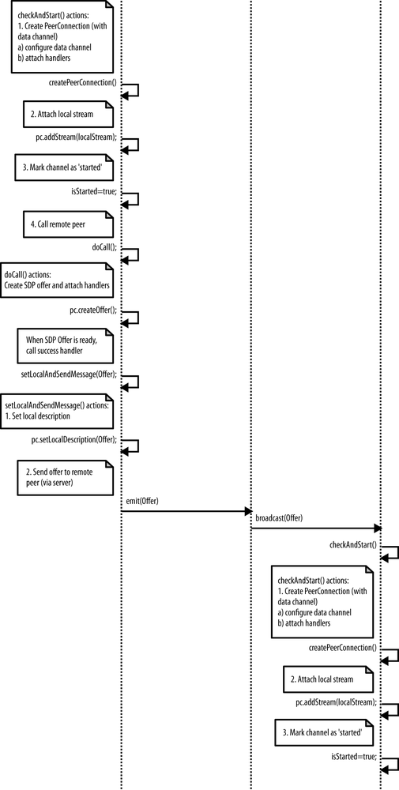
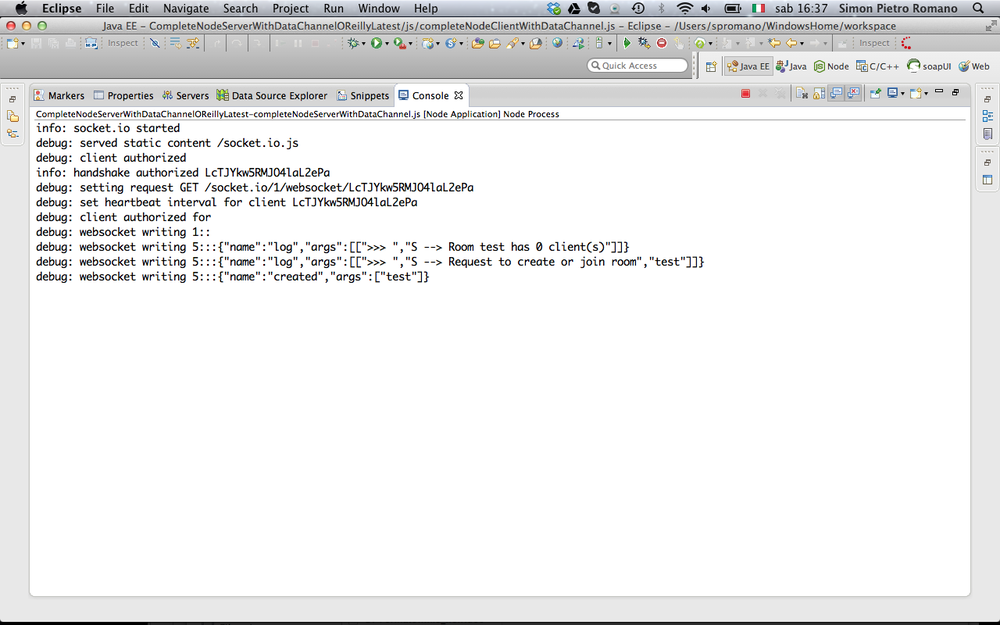
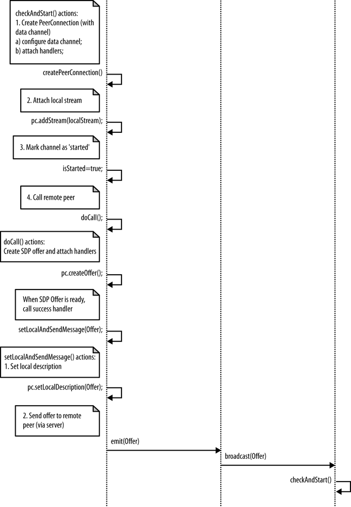
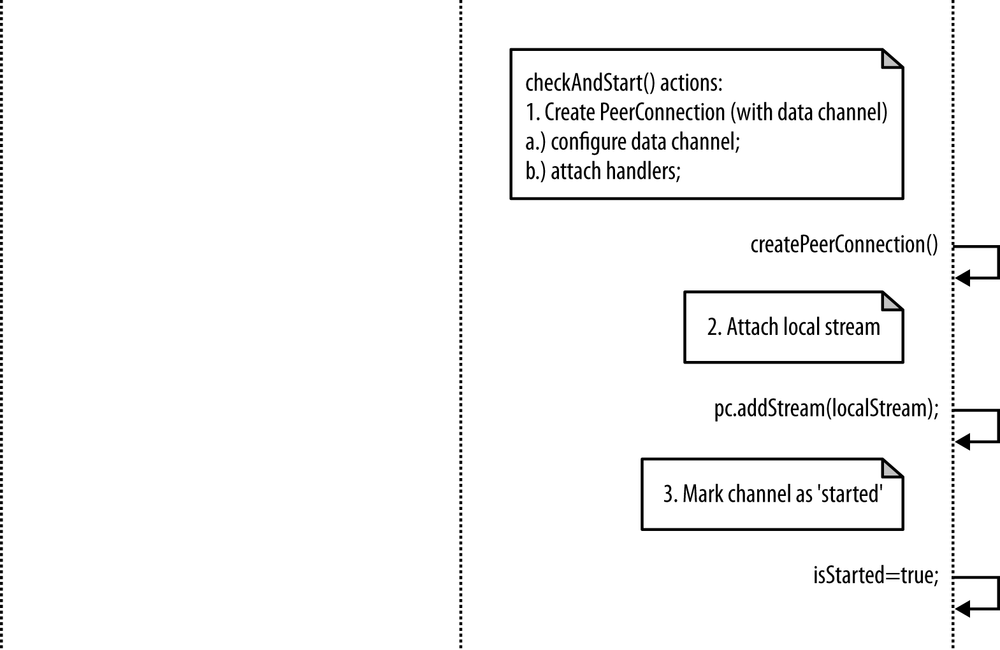

第5章 放在一起：拼凑出你的第一个 WebRTC 系统
=====

我们终于准备好将所有部分放在一起，并构建我们的第一个 WebRTC 应用程序。
在本章中，通过利用像我们在 第4章 中描述的那样的信令服务器，我们将在分布式方案中实现浏览器 RTC 梯形。
基本上，我们将以 第3章 的运行示例为例，并使其也超出本地视角的范围。


我们将展示如何使用信令信道来允许两个对等方交换用户媒体信息，会话描述 和 ICE 协议候选者。
我们还将重点介绍如何仅在设置阶段证明信令服务器角色是基础。
实际上，一旦成功交换了上述信息，通信模式便切换为纯对等，服务器本身不参与实际的数据交换。


## 完整的 WebRTC 呼叫流程

图5-1、5-2 和 5-3 提供了与完整的 WebRTC 呼叫流程图，该流程涉及一个信道发起方，一个信道连接器以及在信道建立时在它们之间中继消息的信令服务器。


图5-1 WebRTC 调用流程：序列图，第 1 部分



图5-2 WebRTC 调用流程：序列图，第 2 部分


图5-3 WebRTC 调用流程：序列图，第 3 部分


序列图通过以下步骤变化：

1. Initiator 连接到服务器，并使其创建信令通道。
2. Initiator（在获得用户同意后）可以访问用户的媒体。
3. Joiner 连接到服务器并加入频道。
4. 当 Joiner 还可以访问本地用户的媒体时，将通过服务器将一条消息发送给 Initiator ，从而触发协商过程：
  - 发起方创建 `PeerConnection` ，向其添加本地流，创建 SDP `offer`，然后通过信令服务器将其发送到 Joiner。
  - 收到 SDP `offer` 后，Joiner 会通过创建 `PeerConnection` 对象，向其添加本地流并构建 SDP `answer` 以（通过服务器）发送回远程方来镜像发起方的行为。
5. 在协商过程中，双方利用信令服务器交换网络可达性信息（以 ICE 协议候选地址的形式）。
6. 当 Initiator 收到 Joiner 对其自己的`offer` 返回的 `answer` 时，协商过程结束：
  - 双方通过利用各自的 `PeerConnection` 对象切换到对等通信，`PeerConnection` 对象还配备了可用于直接交换文本消息的数据通道(data channel)。


在以下各节中，我们将通过详细分析每个步骤来逐步完成这些步骤。 在进行此操作之前，让我们介绍作为本章的运行示例而设计的简单 Web 应用程序。
HTML 代码在 例5-1 中。


例5-1 简单的 WebRTC 应用程序

```html
<!DOCTYPE html>
<html>
  <head>
    <title>Very simple WebRTC application with a Node.js signaling server</title>
  </head>
  <body>
    <div id='mainDiv'>
      <table border="1" width="100%">
        <tr>
          <th>
            Local video
          </th>
          <th>
            Remote video
          </th>
        </tr>
        <tr>
          <td>
            <video id="localVideo" autoplay></video>
          </td>
          <td>
            <video id="remoteVideo" autoplay></video>
          </td>
        </tr>
        <tr>
          <td align="center">
            <textarea rows="4" cols="60"id="dataChannelSend" disabledplaceholder="This will be enabled once the data channel is up..."></textarea>
          </td>
          <td align="center">
            <textarea rows="4" cols="60"id="dataChannelReceive" disabled></textarea>
          </td>
        </tr>
        <tr>
          <td align="center">
            <button id="sendButton" disabled>Send</button>
          </td>
          <td>
          </td>
        </tr>
      </table>
    </div>
    <script src='/socket.io/socket.io.js'></script>
    <script src='js/lib/adapter.js'></script>
    <script src='js/completeNodeClientWithDataChannel.js'></script>
  </body>
</html>
```

本地视频以及本地数据通道信息显示在页面的左侧，而远程视频和数据则显示在窗口的右侧。 该页面涉及三个脚本文件，第一个是已经介绍的 socket.io 库（请参阅第66页的 “ socket.io JavaScript 库” ）。 至于第二个文件（adapter.js），它是一个方便的 JavaScript 填充程序库，可通过适当抽象浏览器前缀以及其他浏览器差异和供应商当前解释规格的方式更改，来帮助程序员。 最后，`completeNodeClientWithDataChannel.js` 包含实际的客户端代码，并在 例5-2 中完整介绍了该示例，以使读者受益。 在本章的其余部分中，我们将深入研究该文件的详细信息。


例5-2 `completeNodeClientWithDataChannel.js`

[由于这段代码太长，单独放到一个文件里了](js/completeNodeClientWithDataChannel.js)

根据 第4章 中包含的信息，读者在理解信令服务器的行为时应该不会遇到任何问题，信令服务器已作为 Node.js 应用程序编写，其代码复制如下：

```javascript
var static = require('node-static');
var http = require('http');

// Create a node-static server instance
var file = new(static.Server)();

// We use the http module’s createServer function and
// rely on our instance of node-static to serve the files
var app = http.createServer(function (req, res) {
  file.serve(req, res);
}).listen(8181);

// Use socket.io JavaScript library for real-time web applications
var io = require('socket.io').listen(app);

// Let's start managing connections...
io.sockets.on('connection', function (socket) {
  // Handle 'message' messages
  socket.on('message', function (message) {
    log('S --> got message: ', message);

    // channel-only broadcast...
    socket.broadcast.to(message.channel).emit('message', message);
  });

  // Handle 'create or join' messages
  socket.on('create or join', function (room) {
    var numClients = io.sockets.clients(room).length;

    log('S --> Room ' + room + ' has ' + numClients + ' client(s)');
    log('S --> Request to create or join room', room);

    // First client joining...
    if (numClients == 0) {
      socket.join(room);
      socket.emit('created', room);
    } else if (numClients == 1) {
      // Second client joining...
      io.sockets.in(room).emit('join', room);
      socket.join(room);
      socket.emit('joined', room);
    } else {
      // max two clients
      socket.emit('full', room);
    }

  });

  function log() {
    var array = [">>> "];
    for (var i = 0; i < arguments.length; i++) {
      array.push(arguments[i]);
    }
    socket.emit('log', array);
  }
});
```

基本上，服务器负责两种通道管理操作（在收到发起方的请求后创建，在第二个对等方到达时加入）和消息中继（在会话建立时）。 正如已经预期的那样，在成功实例化共享信令通道的两个浏览器之间的对等会话之后，它立即完成任务。

现在，让我们开始完整的 WebRTC 示例演练。


## Initiator 加入频道

图5-4 显示了启动上一节中描述的示例 WebRTC 应用程序时，Initiator 采取的动作序列。


图5-4 发起者加入频道

如图所示，将网页加载到浏览器中后，首先会提示用户输入频道名称。 然后，对等方连接到信令服务器，并向其发送创建或加入消息。 这在下面的 JavaScript 代码段中进行了报告，并在 图5-5 的快照中也进行了显示：

```javascript
// Let's get started: prompt user for input (room name)
var room = prompt('Enter room name:');

// Connect to signalling server
var socket = io.connect("http://localhost:8181");

// Send 'create' or 'join' message to singnalling server
if (room !== '') {
  console.log('Create or join room', room);
  socket.emit('create or join', room);
}
```


图5-5 发起者在 Chrome 浏览器中加入

当服务器收到创建或加入消息时，它将对等方识别为发起方，并创建与所需通道关联的服务器端房间。 最终它将创建的消息发送回客户端：

```javascript
// Handle 'create or join' messages
socket.on('create or join', function (room) {
  var numClients = io.sockets.clients(room).length;
  log('S --> Room ' + room + ' has ' + numClients + ' client(s)');
  log('S --> Request to create or join room', room);

  // First client joining...
  if (numClients == 0){socket.join(room);
    socket.emit('created', room);
  } else if (numClients == 1) {

  ...
```

图5-6 显示了此阶段的服务器控制台。



图5-6 信令服务器创建信令通道

现在我们到达了客户端从服务器获取一条创建的消息并意识到它将扮演通道发起者的角色：

```javascript
// Handle 'created' message coming back from server:
// this peer is the initiator
socket.on('created', function (room) {
  console.log('Created room ' + room);
  isInitiator = true;
  ...
```

客户端执行的下一个动作是通过 `getUserMedia()` API调用来访问用户的媒体：

图5-7 显示了在获得用户同意之前浏览器的窗口。


图5-7 Initiator 征求用户同意

以下快照报告了 `handleUserMedia()` 成功处理程序执行的操作：
1. 检索到的视频流附加到 HTML 页面的本地 `<video>` 元素
2. 获取到的用户媒体消息发送给服务器

```javascript
// Call getUserMedia()
navigator.getUserMedia(constraints, handleUserMedia, handleUserMediaError);
console.log('Getting user media with constraints', constraints);
```

这些操作中的第一个操作的效果如 图5-8 所示。


图5-8 用户同意后的发起者

下面是用于向服务器发送消息的 JavaScript 代码：

```javascript
// Send message to the other peer via the signaling server
function sendMessage(message){
  console.log('Sending message: ', message);
  socket.emit('message', message);
}
```

以下摘录中显示了与接收通用消息相关的服务器端行为。 服务器首先将一条日志消息（在 图5-8 下部的浏览器控制台中也可见）发送回客户端，然后将接收到的消息广播到远程方（如果存在）（不是这种情况） 在呼叫流程的这一点）：

```javascript
// Handle 'message' messages
socket.on('message', function (message) {
  log('S --> got message: ', message);
  // channel-only broadcast...
  socket.broadcast.to(message.channel).emit('message', message);
});
```

通道启动程序执行的最后一个操作是 `checkAndStart()` 函数的执行，由于通道尚未准备好，在整个调用流程的此阶段，该函数实际上不执行任何操作：

```javascript
function checkAndStart() {
  // Do nothing if channel not ready...
  if (!isStarted && typeof localStream != 'undefined' && isChannelReady) {
    ...
```

## Joiner 加入频道

现在，让我们找出第二个同伴加入该频道时发生的情况。 相关的动作顺序如 图5-9 所示。

该图的第一部分反映了发起方的行为，提示用户输入频道名称，并向服务器发送创建或加入消息。 这次在服务器端进行消息处理（图5-10 中报告了服务器的控制台），设想将联接消息发送到发起方（后者现在可以将通道标记为就绪），紧接着是对 Joiner 的联接响应 ：

```javascript
} else if (numClients == 1) {
  // Second client joining...
  io.sockets.in(room).emit('join', room);
  socket.join(room);
  socket.emit('joined', room);
} else {
  // max two clients
```

以下摘录显示了与接收加入消息关联的客户端操作：

```javascript
// Handle 'join' message coming back from server:
// another peer is joining the channel
socket.on('join', function (room){
  console.log('Another peer made a request to join room ' + room);
  console.log('This peer is the initiator of room ' + room + '!');
  isChannelReady = true;
});
```

最后，以下 JavaScript 说明了客户端如何意识到自己在扮演 Joiner 的角色，因为它返回了对 create 或 join 请求的连接响应：


图5-9 Joiner 加入频道

```javascript
// Handle 'joined' message coming back from server:
// this is the second peer joining the channel
socket.on('joined', function (room) {
  console.log('This peer has joined room ' + room);
  isChannelReady = true;
});
```


图5-10 信令服务器管理 Joiner 的请求


从这一点开始， Joiner 在协商的此阶段执行的其余操作与我们在上一节中查看 Initiator 的角色时所描述的操作完全相同：
1. 访问本地媒体（等待用户的访问） 同意）
2. 将本地视频附加到 HTML 页面
3. 通过信令服务器将获取的用户媒体消息发送给远程对等体


## Initiator 开始协商

接收到服务器中继的用户媒体消息后，发起者将再次激活 `checkAndStart()` 函数，由于边界条件现在已更改，因此这一次实际上已执行：通道已准备就绪，本地流已 由 `getUserMedia()` API 调用提供。

图5-11 中的 UML 快照和以下 JavaScript 代码指示发起方（1）创建了 `PeerConnection` 对象； （2）将频道标记为已开始； （3）激活 `doCall()` JavaScript 函数。

```javascript
// Channel negotiation trigger function
function checkAndStart() {
  if (!isStarted && typeof localStream != 'undefined' && isChannelReady) {
    createPeerConnection();
    isStarted = true;
    if (isInitiator) {
      doCall();
    }
  }
}
```

深入研究上述操作的详细信息，以下代码摘录显示，为正确管理 ICE 候选地址以及远程流的添加和删除，`PeerConnection` 对象附加了许多处理程序。
此外，`PeerConnection` 还配备了一个数据通道，该通道将用于以对等方式与 Joiner 交换文本数据：

```javascript
function createPeerConnection() {
  try {
    pc = new RTCPeerConnection(pc_config, pc_constraints);

    pc.addStream(localStream);

    pc.onicecandidate = handleIceCandidate;
    console.log('Created RTCPeerConnnection with:\n' + '  config: \'' + JSON.stringify(pc_config) + '\';\n' + '  constraints: \'' + JSON.stringify(pc_constraints) + '\'.');
  } catch (e) {
    console.log('Failed to create PeerConnection, exception: ' + e.message);
    alert('Cannot create RTCPeerConnection object.');
    return;
  }

  pc.onaddstream = handleRemoteStreamAdded;
  pc.onremovestream = handleRemoteStreamRemoved;

  if (isInitiator) {
    try {
      // Create a reliable data channel
      sendChannel = pc.createDataChannel("sendDataChannel",{reliable: true});
      trace('Created send data channel');
    } catch (e) {
      alert('Failed to create data channel. ');
      trace('createDataChannel() failed with exception: ' + e.message);
    }
    sendChannel.onopen = handleSendChannelStateChange;
    sendChannel.onmessage = handleMessage;
    sendChannel.onclose = handleSendChannelStateChange;
  } else {
    // Joiner
    pc.ondatachannel = gotReceiveChannel;
  }
}
```



图5-11 Initiator 开始协商

关于 `doCall()` 函数，它基本上在可用的 `PeerConnection` 上调用 `createOffer()` 方法，要求浏览器正确构建一个 SDP （会话描述协议）对象，该对象代表发起方的媒体和要传达给远程方的功能：

```javascript
function doCall() {
  console.log('Creating Offer...');
  pc.createOffer(setLocalAndSendMessage, onSignalingError, sdpConstraints);
}
```

与此调用关联的成功处理程序负责将浏览器提供的 SDP 与 `PeerConnection` 相关联，并通过信令服务器将其传输到远程对等方：

```javascript
function setLocalAndSendMessage(sessionDescription) {
  pc.setLocalDescription(sessionDescription);
  sendMessage(sessionDescription);
}
```

## Joiner 管理 Initiator 的 `offer`

图5-12 显示了 Joiner 在收到发起者的 SDP offer 后采取的操作。

实际上，如下面的 JavaScript 代码片段所示，当 offer 到达 Joiner 时，首先运行 `checkAndStart()` 函数：

```javascript
// Receive message from the other peer via the signalling server
socket.on('message', function (message) {

  console.log('Received message:', message);
  if (message === 'got user media') {

    ...

  } else if (message.type === 'offer') {
      if (!isInitiator && !isStarted) {
        checkAndStart();
      }

      pc.setRemoteDescription(new RTCSessionDescription(message));
      doAnswer();

  } else if (message.type === 'answer' && isStarted) {

  ...
```



图5-12 参加 Initiator 的 offer 后，Joiner 的操作

当由 Joiner 执行时，此函数将创建 Joiner 的 `PeerConnection` 对象并设置 `isStarted` 标志：

```javascript
function checkAndStart() {
  if (!isStarted && typeof localStream != 'undefined' && isChannelReady) {
    createPeerConnection();
    isStarted = true;
    if (isInitiator) {
      ...
    }
  }
}
```

如第121页 的 “ Joiner 的 `answer` ” 中所述，一旦使用 `checkAndStart()` 函数完成，Joiner 仍然必须配置其本地 `PeerConnection` 并正确构建 SDP `answer` 以发送回发起方。 在下文中，我们将首先简要讨论双方所需的 ICE 候选人交换程序。


## ICE 候选人交换

正如我们已经预料到的，信令服务器的主要任务之一是使发起方和连接方之间的网络可达性信息能够交换，从而可以在两者之间建立媒体包流。
交互式连接建立（ICE）[RFC5245](https://tools.ietf.org/html/rfc5245) 技术允许对等方发现有关彼此拓扑的足够信息，从而有可能在彼此之间找到一条或多条通信路径。

此类信息由与每个 `RTCPeerConnection` 对象关联的 ICE 代理在本地收集。 ICE 代理负责：

* 收集本地IP，端口元组候选
* 在同级之间执行连接检查
* 发送连接保持活动


设置会话描述（本地或远程）后，本地 ICE 代理会自动开始发现本地对等方所有可能候选者的过程：
1. ICE 代理向操作系统查询本地 IP 地址。
2. 如果已配置，它将查询外部 STUN 服务器以检索对等方的公共 IP 地址和端口元组。
3. 如果已配置，则代理还将 TURN 服务器用作最后的手段。 如果对等连接检查失败，则媒体流将通过 TURN 服务器进行中继。


每当发现新的候选对象（即IP，port tuple）时，ICE 代理就会自动将其注册到 `RTCPeerConnection` 对象，并通过回调函数（`onIceCandidate`）通知应用程序。 该应用程序可以决定在发现每个候选者之后（Trickle ICE）尽快将其转移到远程方，或者决定等待 ICE 收集阶段完成，然后立即发送所有候选者。

与该特定阶段关联的事件顺序如 图5-13 所示。


图5-13 服务器引导的 ICE 候选人交换

该图显示，只要浏览器引发 `IceCandidate` 事件（因为已经收集了一个新的 ICE 候选对象），就会激活 `handleIceCandidate()` 处理程序。 此处理程序将检索到的候选者包装在专用候选者消息中，该消息将通过服务器发送给远程方：

```javascript
function handleIceCandidate(event) {
  console.log('handleIceCandidate event: ', event);
  if (event.candidate) {
    sendMessage({type: 'candidate',label: event.candidate.sdpMLineIndex,id: event.candidate.sdpMid,candidate: event.candidate.candidate});
  } else {
    console.log('End of candidates.');
  }
}
```

像往常一样，服务器只是充当两个协商方之间的中介者，如 图5-14 中的控制台快照所示，它显示了服务器如何中继发起方发送的 SDP 描述和中继方检索到的 ICE 候选地址。 两个相互作用的同伴。


图5-14 服务器引导的协商日志

最后，下面显示的 JavaScript 代码段指示两个对等点一从信令服务器到达，便立即将接收到的候选者添加到其自己的 `PeerConnection` 对象中：

```javascript
// Receive message from the other peer via the signaling server
socket.on('message', function (message) {
  console.log('Received message:', message);
  if (message === 'got user media') {
    ...
  } else if (message.type === 'offer') {
    ...
  } else if (message.type === 'answer' && isStarted) {
    ...
  } else if (message.type === 'candidate' && isStarted) {
      var candidate = new RTCIceCandidate({
        sdpMLineIndex: message.label,
        candidate:message.candidate
      });
      pc.addIceCandidate(candidate);
  } else if (message === 'bye' && isStarted) {
    ...
  }
});
```

一旦其他对等方收到 ICE 候选对象，便在 `RTCPeerConnection` 对象（`setRemoteDescription`）上设置了远程会话描述，因此 ICE 代理可以开始执行连接检查以查看它是否可以到达其他对等方。


此时，每个 ICE 代理都有其候选人和其同行候选人的完整列表。 将它们配对。 为了查看哪个对有效，每个代理计划安排一系列优先检查：首先检查本地 IP 地址，然后检查公共 IP 地址，最后使用 TURN。 每次检查都是客户端将通过从本地候选者向远程候选者发送 STUN 请求而对特定候选对执行的 STUN request/response 事务。

如果一对候选对象中的一个可行，则存在用于点对点连接的路由路径。 相反，如果所有候选项均失败，则 `RTCPeerConnection` 被标记为失败，或者连接回退到 TURN 中继服务器以建立连接。

建立连接后，ICE 代理会继续向其他对等方发出定期的 STUN 请求。 这用作连接保持活动状态。

* * *

# Trickle ICE

Trickle ICE 是ICE协议的拟议扩展，在其中，无需等待 ICE 收集过程完成，就可以向其他对等方发送增量更新。 这有助于加快整个设置阶段。

Trickle ICE机制涉及以下步骤：
* 双方交换没有 ICE 候选人的 SDP offer
* 一旦发现 ICE 候选者，便通过信令信道发送它们。
* 只要有新的候选者描述，便会运行ICE连接检查。

* * *

## Joiner’s Answer

既然我们已经完成了 ICE 候选人交换，那么让我们重新思考一下。
我们当时（第115页上的“ Joiner 管理 Initiator 的 Offer ”）是 Joiner 通过创建自己的 `PeerConnection` 对象来处理 Initiator 的 Offer 的时候。
如 图5-15 所示，完成此操作后，Joiner 首先将接收到的 SDP 与新实例化的 `PeerConnection` 相关联，然后立即调用 `doAnswer()` JavaScript 函数。


图5-15 Joiner’s Answer to Initiator’s Offer

下面的代码片段突出显示了 Joiner 算法的这一特定部分：

```javascript
// Receive message from the other peer via the signaling server
socket.on('message', function (message) {
  console.log('Received message:', message);
  if (message === 'got user media') {
    ...
  } else if (message.type === 'offer') {
    ...
    pc.setRemoteDescription(new RTCSessionDescription(message));

    doAnswer();

  } else if (message.type === 'answer' && isStarted) {
...
```

`doAnswer()` 函数基本上处理与接收到的 Offer 关联的 SDP Answer 的创建：

```javascript
function doAnswer() {
  console.log('Sending answer to peer.');
  pc.createAnswer(setLocalAndSendMessage,onSignalingError, sdpConstraints);
}
```


与 `createOffer()` 方法类似，一旦浏览器使本地 SDP 可用， `createAnswer()` 调用将设置成功处理程序，该处理程序将被调用。 这种处理程序的作用是首先将浏览器提供的 SDP 设置为与 Joiner 的 `PeerConnection` 相关联的本地会话描述，然后通过信令服务器将此类描述发送给远程方：


```javascript
function setLocalAndSendMessage(sessionDescription) {
  pc.setLocalDescription(sessionDescription);
  sendMessage(sessionDescription);
}
```

当启动器从服务器接收到 Joiner's Answer 时，可以将其正确设置为与其本地 `PeerConnection` 对象关联的远程会话描述：

```javascript
// Receive message from the other peer via the signaling server
socket.on('message', function (message) {
  console.log('Received message:', message);
  if (message === 'got user media') {
    ...
  } else if (message.type === 'offer') {
    ...
  } else if (message.type === 'answer' && isStarted) {
    pc.setRemoteDescription(new RTCSessionDescription(message));
  } else if (message.type === 'candidate' && isStarted) {
    ...
  } else if (message === 'bye' && isStarted) {
    ...
  }
});
```

## 开始点对点！

我们终于准备好了！ 两个对等方已成功交换会话描述和网络可达性信息。 借助信令服务器的中介，已经正确设置和配置了两个 `PeerConnection` 对象。 如 图5-16 所示，双向多媒体通信通道现在可用作两个浏览器之间的直接传输工具。 现在服务器已完成其任务，并且此后将被两个通信对等方完全绕开。


图5-16 点对点建立后进行通讯

成功进行渠道协商后，图5-17 和 图5-18 中的两个快照分别显示了 Joiner 和 Initiator 的窗口。 您可以在两个图中看到，每个对等方现在都具有可用的本地视图和远程视图，以及可以分别用于向远程用户发送直接消息和记录从远程用户接收的直接消息的两个文本区域。


图5-17 在 Chrome 中建立了通信：Joiner


图5-18 在 Chrome 中建立通信：Initiator

### 使用 Data Channel

在本小节中，我们将深入研究配置和使用数据通道的细节。实际上，数据通道是由启动器创建的，它是 `createPeerConnection()` 函数代码的一部分：

```javascript
function createPeerConnection() {
  try {
    pc = new RTCPeerConnection(pc_config, pc_constraints);
    ...
  } catch (e) {
    ...
  }

  pc.onaddstream = handleRemoteStreamAdded;
  pc.onremovestream = handleRemoteStreamRemoved;

  if (isInitiator) {
    try {
      // Create a reliable data channelsendChannel = pc.createDataChannel("sendDataChannel",{
      reliable: true});
      trace('Created send data channel');
    } catch (e) {
      ...
    }

    sendChannel.onopen = handleSendChannelStateChange;
    sendChannel.onmessage = handleMessage;
    sendChannel.onclose = handleSendChannelStateChange;

  } else {
    // Joiner
    pc.ondatachannel = gotReceiveChannel;
  }
}
```

上面的代码片段显示了如何将多个处理程序与数据通道相关联。 例如，我们在 `handleSendChannelStateChange()` 函数下方显示该函数，该函数负责在通道达到打开状态后立即启用发送者的文本区域和 “发送” 按钮：

```javascript
function handleSendChannelStateChange() {
  var readyState = sendChannel.readyState;
  trace('Send channel state is: ' + readyState);
  if (readyState == "open") {
    dataChannelSend.disabled = false;
    dataChannelSend.focus();
    dataChannelSend.placeholder = "";
    sendButton.disabled = false;
  } else {
    dataChannelSend.disabled = true;
    sendButton.disabled = true;
  }
}
```

下面显示的 `sendData()` JavaScript 函数配置为 “发送” 按钮的处理程序，并执行以下操作：（1）收集用户在 `sendTextArea` 中插入的文本； （2）通过实例化数据通道发送此类文本。

```javascript
// Handler associated with Send button
sendButton.onclick = sendData;
...
function sendData() {
  var data = sendTextarea.value;
  if(isInitiator) sendChannel.send(data);
  else receiveChannel.send(data);
  trace('Sent data: ' + data);
}
```

图5-19 显示了通过数据通道发送文本消息之后的发起方窗口。


图5-19 使用数据通道：Initiator

消息到达另一侧后，将触发 `handleMessage()` 函数，如下所示，该函数仅获取已传输的数据并将其记录在 HTML 页面的 `receiveTextArea` 元素中：

```javascript
function handleMessage(event) {
  trace('Received message: ' + event.data);
  receiveTextarea.value += event.data + '\n';
}
```

这也显示在 图5-20 中的快照中。


图5-20 使用数据通道：加入方

转到接收频道， Joiner 的浏览器引发 `dataChannel` 事件后，就会激活 `getReceiveChannel()` 函数。 该处理程序设置接收通道并正确配置它以管理与通道相关的事件：

```javascript
function gotReceiveChannel(event) {
  trace('Receive Channel Callback');
  receiveChannel = event.channel;
  receiveChannel.onmessage = handleMessage;
  receiveChannel.onopen = handleReceiveChannelStateChange;
  receiveChannel.onclose = handleReceiveChannelStateChange;
}
```

图5-21 和 图5-22 分别显示了 Joiner 通过数据通道将答案发送回 Initiator ， Initiator 接收答案并将其记录在数据通道文本区域内。


图5-21 Data channel: Joiner 回答 Initiator 的消息


图5-22 Data channel: Initiator 获得 Joiner 的回答

## 快速浏览 Chrome WebRTC 内部工具

在最后一部分中，我们将提供有关 Google Chrome 提供的特定于 WebRTC 的调试工具的信息。 确实，当您使用支持 WebRTC 的网络应用程序时，可以通过打开一个新标签页并在该标签页的位置栏中输入 `chrome://webrtc-internals/` 来监视其状态。 对于我们的示例应用程序，图5-23 给出了 `webrtc-internals` 选项卡的快照。


图5-23 活动的 PeerConnections

如图所示，日志记录页面报告有关活动 `PeerConnection` 对象的信息。 在本例中，由于我们在同一台计算机上同时运行 Initiator 和 Joiner ，因此我们看到了两个活动的 `PeerConnection` 实例，分别与 Initiator （`PeerConnection` 71221-1）和 Joiner （`PeerConnection` 71229-1）关联。 通过单击报告的标识符之一，将显示有关相关 `PeerConnection` 的详细信息。 例如，图5-24 和 图5-25 分别以 SDP 对象的形式显示了发起者的 Offer 和相应的 Joiner 的 Answer 。 在同一图中，您还可以看到浏览器在处理呼叫时生成的所有事件的列表。


图5-24 SDP Offer


图5-25 SDP Answer

Chrome 也非常擅长报告点对点交换所涉及的所有媒体的渠道统计信息。 例如，您可以在 图5-26 中看到针对音频，视频和数据通道报告了通道信息（通道创建时间戳，处理通道的浏览器组件，用于安全信息交换的本地和远程通道证书）。


图5-26 Channel 统计 文字格式

相反， 图5-27 以图形格式报告有关网络相关的详细信息（估计可用带宽，每秒发送的数据包，平均往返时间等）以及与编码相关的详细信息（目标编码比特率，实际编码比特） 速率等）有关媒体（即音频和视频）流的信息。


图5-27 Channel 统计 图形格式

最后，图5-28 说明了浏览器实际上是如何负责跟踪 ICE 协议机器状态更改以及为上层应用程序生成相关事件的。


图5-28 信令状态机与 ICE 候选事件

